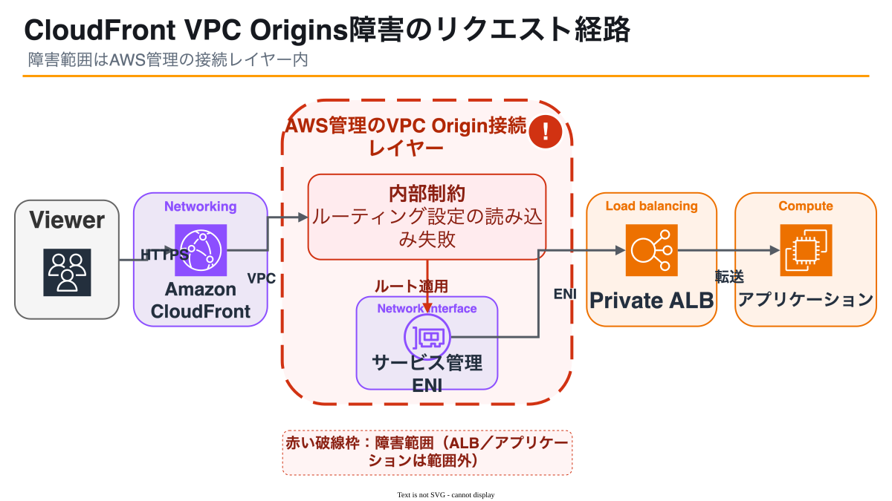
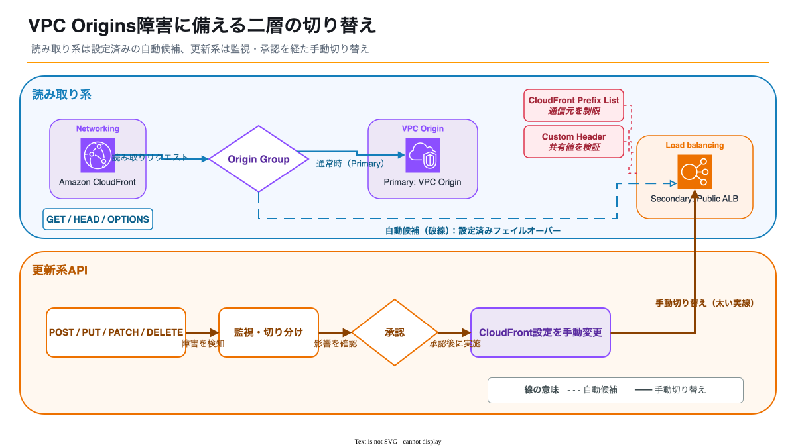

2026年7月16日、Amazon CloudFrontでVPC Origins接続を利用していた顧客に5xxエラーが増加しました。影響はCloudFrontのすべてのオリジンに及んだわけではなく、プライベートVPCオリジンへの接続経路に限られていました。

私の管理環境ではCloudFrontを利用していなかったため、直接的な影響はありませんでした。ただし、AWSの障害報告を受けて管理環境を確認し、VPCオリジンを使う場合の代替経路と切り替え手順を公式資料から調べました。

> 今回確認するべきなのは、CloudFrontというサービス全般ではなく、CloudFrontからプライベートVPCオリジンへ届く経路です。

## 2026年7月16日のCloudFront障害で何が起きたか

[AWS Health Dashboard](https://health.aws.amazon.com/health/status)の最終報告によると、障害期間は2026年7月16日16:45から20:18（日本時間）までの3時間33分です。米国太平洋夏時間では12:45 AM PDTから4:18 AM PDTに当たります。この間、CloudFrontでVPC Origins接続を利用していた顧客に5xxエラーが増加しました。

AWSは3:52 AM PDTに複数の緩和策を実施し、4:18 AM PDTに全面復旧したと報告しています。最終更新では、他のオリジン種別を利用していた顧客は今回の事象の影響を受けず、サービスは正常に稼働しているとされました。

参照した[AWS公開イベントデータ](https://health.aws.amazon.com/public/currentevents)のEvent ARNはarn:aws:health:global::event/CLOUDFRONT/AWS_CLOUDFRONT_OPERATIONAL_ISSUE/AWS_CLOUDFRONT_OPERATIONAL_ISSUE_EDF4C_83808542A4Eです（2026年7月17日確認）。

## 影響を受けた構成・受けなかった構成

今回影響を受けたのは、CloudFrontからVPC Originsの接続を通り、プライベートサブネットのALB、NLB、EC2へ到達する構成です。オリジンのアプリケーションやALBターゲットが正常でも、その手前にあるVPC Originのルーティングが成立しなければ、閲覧者には5xxが返り得ます。

一方、AWSの報告では、S3オリジンやインターネットへ公開したカスタムオリジンなど、他のオリジン種別は今回の事象では影響外でした。ここで述べているのは今回のイベントに限った影響範囲です。各オリジン種別の障害耐性を一般化するものではありません。

切り分けでは、CloudFrontの5xxだけを見てオリジンアプリケーションの故障と決めつけないことが大切です。CloudFrontからオリジンまでのリクエスト数、ALBの応答、ターゲットの健全性を合わせて確認すると、問題のある区間を絞れます。

## そもそもCloudFrontのVPCオリジンとは

[VPC origins](https://docs.aws.amazon.com/AmazonCloudFront/latest/DeveloperGuide/private-content-vpc-origins.html)は、プライベートサブネットに置いたALB、NLB、EC2をCloudFrontのオリジンにする機能です。CloudFrontは指定したサブネットへサービス管理ENI（Elastic Network Interface）を作成し、プライベートな接続でオリジンへリクエストを届けます。

この構成なら、ロードバランサーやEC2をインターネットへ直接公開せず、CloudFrontを入口にできます。公開用のアクセス制御を個別に組む負担も減らせます。ただし、CloudFrontが管理する接続経路へ依存する点は、可用性を考えるときに無視できません。

作成要件には、VPCへInternet Gateway（IGW）を追加することも含まれます。IGWはそのVPCがインターネットからトラフィックを受けられることを示すために必要ですが、VPCオリジンへトラフィックをルーティングする経路には使われません。この要件だけを見て、プライベートオリジンがIGW経由で公開されると解釈しないようにします。

## 障害の原因をリクエスト経路から理解する

AWSの最終報告では、プライベートVPCオリジンへの接続を管理するフリートが内部制約に達しました。その結果、ネットワークプロセッサへルーティング設定を配布するシステムが、更新済みの設定データを正しく読み込めなくなったと説明されています。これがVPC Origin接続のルーティングへ影響しました。

原因を単なる容量不足や設定ミスと言い換えると、最終報告にある因果関係が抜け落ちます。内部制約への到達、設定配布システムの読み込み失敗、VPC Originのルーティングへの影響という順で捉える必要があります。

<!-- prettier-ignore -->
*図1：CloudFrontからVPCオリジンへ到達する概念的な経路*

図1は、閲覧者からCloudFront、AWS管理のVPC Origin接続層、サービス管理ENI、Private ALB、アプリケーションへ進む概念図です。AWSが公開していないフリートの構成、台数、ネットワークプロセッサの配置は推測していません。障害箇所も、AWS最終報告の範囲でAWS管理領域にまとめています。

## AWSが案内した暫定回避策

障害中にAWSが案内した回避策は、VPC Originsが必須でない場合に、一時的に別のオリジン種別へ変更することでした。これは当日のAWSによる案内です。復旧後には、一時変更を安全に元へ戻せると報告されました。

ただし、障害が起きてから代替のPublic ALBを作る場合、ALBの構築、TLS証明書、アクセス制限、CloudFrontへの登録、設定反映、動作確認が必要です。緊急時に初めて作るには確認事項が多く、切り替えを急ぐほどミスも起きやすくなります。

本記事では、代替オリジンを平常時に登録して確認しておく案を扱います。読み取り系はOrigin Groupを候補にし、更新系は切り分けと承認を経た手動変更に分けます。これはAWSが当日に案内した回避策そのものではなく、その案内を実行できる状態へ近づける運用上の提案です。

<!-- prettier-ignore -->
*図2：読み取り系と更新系を分けた二層の切り替え*

## 読み取り系リクエストをOrigin Groupで備える

[Origin failover](https://docs.aws.amazon.com/AmazonCloudFront/latest/DeveloperGuide/high_availability_origin_failover.html)では、primaryとsecondaryの2オリジンからOrigin Groupを作ります。primaryが設定済みの失敗条件に該当すると、そのリクエストをsecondaryへ送ります。選べるHTTPステータスコードは`400`、`403`、`404`、`416`、`429`、`500`、`502`、`503`、`504`です。

接続失敗をフェイルオーバー対象にするには`503`を、origin response timeoutを対象にするには`504`を条件へ含めます。ここを設定しなければ、接続できない、または応答がtimeoutになったという理由だけで想定したsecondaryへ進むとは限りません。

自動フェイルオーバーが適用されるHTTPメソッドは`GET`、`HEAD`、`OPTIONS`のみに限定されています。`POST`、`PUT`などは対象外です。さらに`OPTIONS`を使う場合は、Cache behaviorのCached HTTP methodsへ`OPTIONS`を含める必要があります。

[Origin Groupのリクエスト動作](https://docs.aws.amazon.com/AmazonCloudFront/latest/DeveloperGuide/RequestAndResponseBehaviorOriginGroups.html)では、前のリクエストがsecondaryへ送られていても、CloudFrontは次のリクエストでprimaryを再試行します。障害中ずっとsecondaryへ固定する仕組みではないため、primaryの試行時間やエラー率も監視対象に残ります。

備えるなら、primaryをVPC origin、secondaryを事前に動作確認したPublic ALBなどのカスタムオリジンにします。今回の障害でOrigin Groupが実際にフェイルオーバーできたことは確認できていないため、この構成は将来の読み取り系障害に備えて事前検証する候補です。有効性を確かめるには、非本番で接続失敗とtimeoutを再現し、期待するステータス条件と所要時間を測ります。

## POST・PUTを含むAPIは手動切り替えを準備する

`POST`、`PUT`、`PATCH`、`DELETE`はOrigin Groupの自動フェイルオーバー対象外なので、更新系は切り分けと承認後に手動でオリジンを変更します。CloudFront distributionへ代替のカスタムオリジンを事前登録し、Cache behaviorの対象を切り替える変更手順をIaCとランブックに残しておきます。

CloudFront Functionsの[`updateRequestOrigin()`](https://docs.aws.amazon.com/AmazonCloudFront/latest/DeveloperGuide/helper-functions-origin-modification.html)ではVPC Originsを更新できないため、リクエストごとの動的な切り替えをこの関数だけで実現しようとすると失敗します。手動切り替えを関数へ置き換える前に、使うAPIと対象オリジンの制約を確認します。

更新系では、タイムアウト後のretryが二重実行につながる可能性があります。冪等キーや重複排除の有無、認証ヘッダー、Host/TLS、Cookieやセッション、データ整合性を代表的な操作で確認します。代替オリジンが同じアプリケーションやデータストアを指していても、ヘッダー転送やセッションストアが違えば同じ結果になるとは限りません。

待機用Public ALBは、直接アクセスを受け付ける状態にしません。[ALBへのアクセス制限](https://docs.aws.amazon.com/AmazonCloudFront/latest/DeveloperGuide/restrict-access-to-load-balancer.html)に従い、セキュリティグループの送信元をCloudFrontのAWS-managed prefix listへ絞ります。さらにCloudFrontから秘密の[`custom header`](https://docs.aws.amazon.com/AmazonCloudFront/latest/DeveloperGuide/add-origin-custom-headers.html)を付け、ALB listener ruleは一致するリクエストだけを転送し、不一致には固定`403`を返します。prefix listだけでは特定のdistributionを識別できないため、二つの制限を組み合わせます。

この待機構成にはALBなどの追加費用がかかり、公開面も増えます。VPC originとPublic ALBでTLS、WAF、認証、ログ、アプリケーション設定を揃える作業も必要です。CloudFrontの設定変更には伝播時間があり、緊急時の切り替えが即時とは限りません。費用、セキュリティ、設定の一貫性、伝播時間を含めて採否を決めます。

## 障害発生時の確認・切り替え手順

CloudFrontの5xx増加を見つけても、すぐに代替オリジンへ変更しません。アプリケーションやデータベース、認証基盤の障害であれば、入口だけ変えても復旧せず、状況を複雑にします。本記事では次の順で確認します。

1. CloudFrontの`5xxErrorRate`などを確認し、増加の開始時刻、対象distribution、Cache behavior、リージョンやURLの偏りを記録する。
2. ALBのリクエスト数と5xx、ターゲットのhealthを確認し、CloudFrontより後ろのアプリケーション、データベース、認証基盤の障害を切り分ける。
3. AWS Health Dashboardとアカウント固有のAWS Health情報を確認し、サービスイベントの対象、開始時刻、更新内容を照合する。
4. 読み取り系では、Origin Groupがsecondaryへフェイルオーバーしているか、primaryでの503または504、secondaryの応答、試行時間を確認する。
5. 更新系では、待機用Public ALBのtarget health、証明書、AWS-managed prefix list、custom headerを確認し、担当者の切り分けと承認を記録してから手動切り替えを実施する。
6. CloudFront経由で代表的な読み取り、書き込み、ログインなどの認証操作を試し、retryによる二重実行、セッション、データ整合性を確認する。
7. [distributionの更新](https://docs.aws.amazon.com/AmazonCloudFront/latest/DeveloperGuide/HowToUpdateDistribution.html)が`Deploying`の間はエッジごとに旧設定と新設定が混在し得るため、反映完了まで新旧両経路のログとメトリクスを監視する。

変更を本番で初めて試さないために、[CloudFront continuous deployment](https://docs.aws.amazon.com/AmazonCloudFront/latest/DeveloperGuide/continuous-deployment.html)のstaging distributionで設定を確認する方法もあります。平常時に代表リクエストと監視項目を決め、切り替え担当者が同じ順番で実行できるようにします。

## 復旧後に元へ戻すときの確認事項

AWS Healthの表示が`Resolved`になったことだけを理由に切り戻すのは避けます。VPCオリジンへの疎通とエラー率が戻り、代表的な読み取り、書き込み、認証操作が通ることを確認してから変更します。

切り戻し前の確認項目は次のとおりです。

- VPC Origin、サービス管理ENI、ALBターゲットが正常で、CloudFront経由の5xxが平常値へ戻っている
- 代替経路で受けた書き込みに欠落や二重実行がなく、データストアの差分とデータ整合性を確認できている
- 認証ヘッダー、Host/TLS、Cookie、セッションが元の経路でも期待どおりに動く
- 緊急変更とIaCの差を確認し、次回のデプロイで設定を巻き戻さない
- 段階的に戻せる場合はstaging distributionや限定トラフィックで確認し、`Deploying`中も新旧経路を監視する

切り戻し後は、検知から承認、設定反映、復旧確認までの時刻を記録します。手作業で迷った箇所や監視できなかった条件を、IaC、アラーム、ランブックへ反映します。

## VPCオリジンをやめるべきか

今回の一事象だけで、VPCオリジンの採用をやめる結論にはなりません。オリジンをプライベートサブネットへ置き、CloudFrontを単一の入口にできる点は明確な利点です。その代わり、CloudFrontが管理するVPC接続経路へ依存します。

Public ALBを待機させれば別のオリジン種別へ切り替えられますが、費用とインターネット公開面が増え、二つの経路の設定を揃え続ける必要があります。Origin Groupにもメソッドと失敗条件の制約があり、更新系は人の判断と設定伝播を待ちます。

判断材料は、許容停止時間、読み取りと更新の比率、手動切り替えに使える時間、セキュリティ要件、待機系の費用です。VPC Originsを使うかどうかに加え、どのリクエストを自動で逃がし、どこから人が承認するかを構成レビューで決めます。
