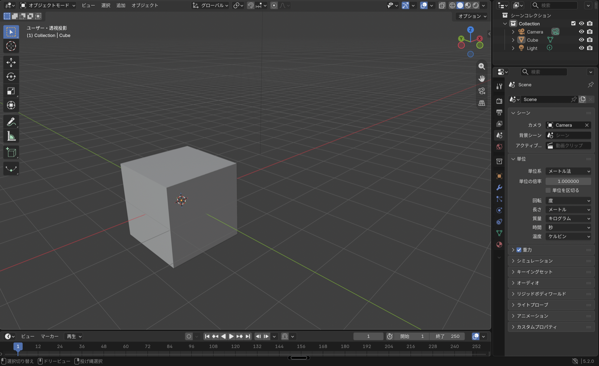
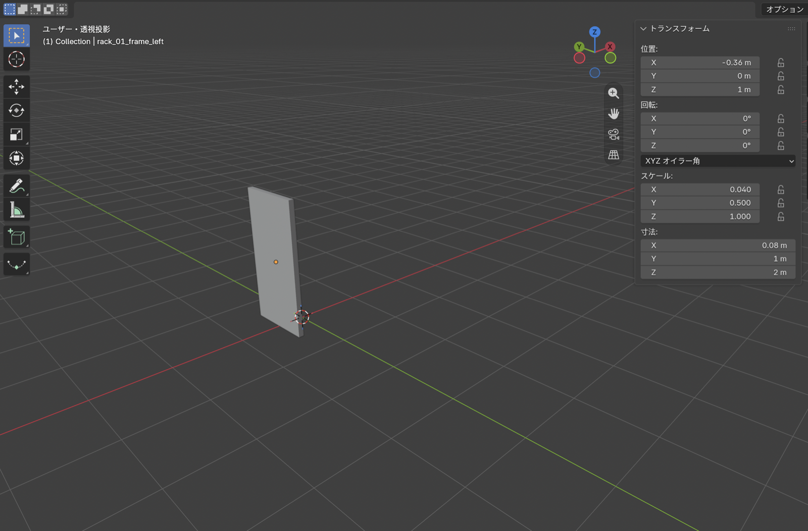
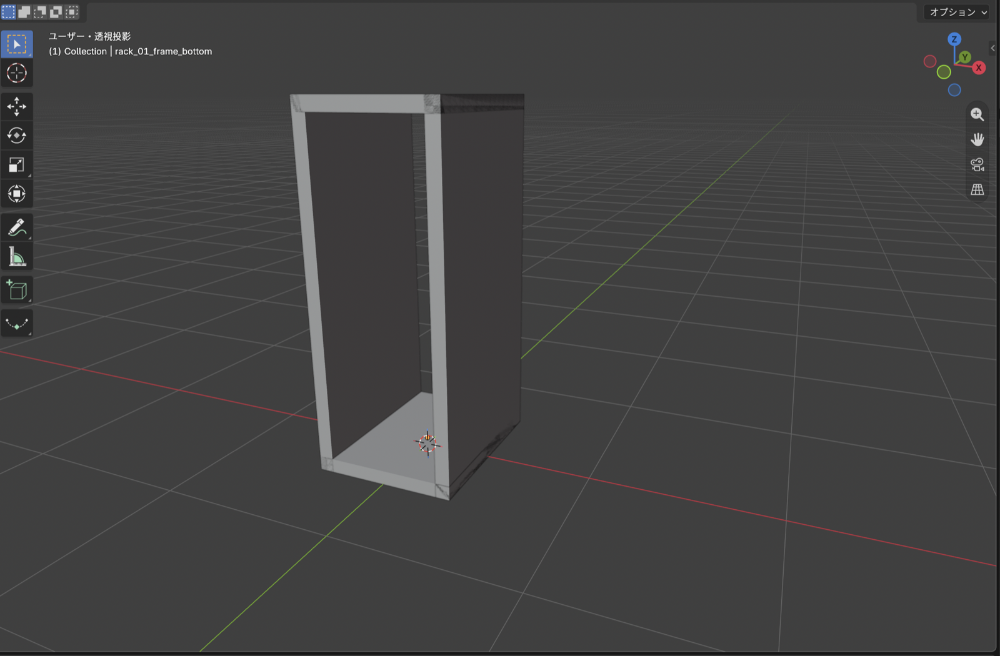
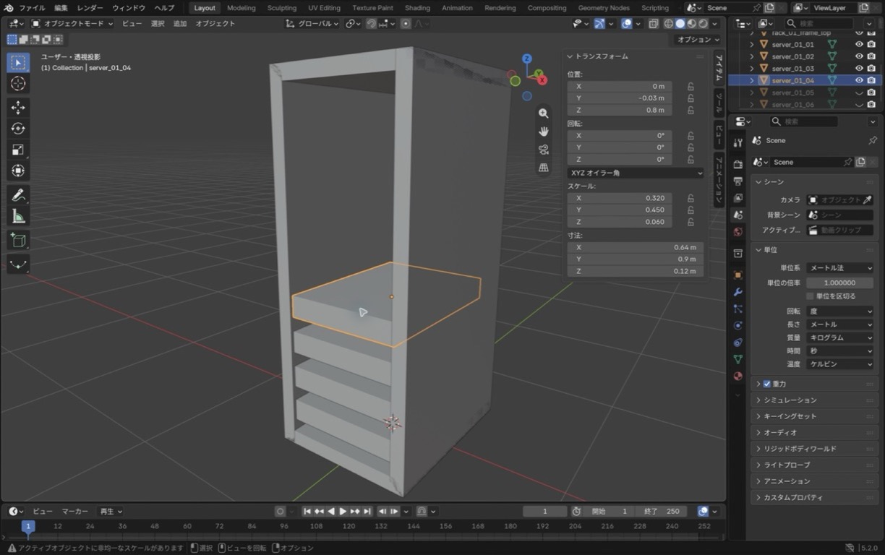
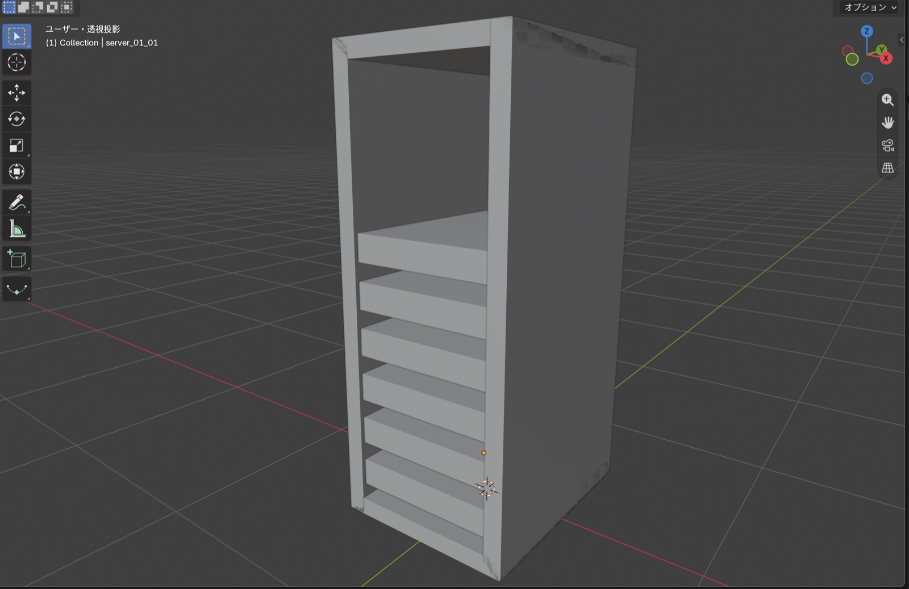

生成AIに操作方法を相談しながら進められることで、以前より3D制作を始めるハードルが下がっているように感じました。そこで、Blenderの勉強を始めてみることにしました。目標は、ブラウザで動かせる3Dサーバールーム監視画面を作ることです。

最初から部屋全体を作ろうとすると、操作を覚える前に迷いそうです。そのため、第1回はサーバーラック1台に絞りました。使った形はCubeだけです。数値を入力してフレームを組み、同じ形を複製して6台のサーバーを並べます。

## 今回作るもの

4個のCubeでラックの外枠を作り、その中へ6個のCubeを並べます。マテリアルや照明は、今回はまだ使いません。

作業環境は次のとおりです。

- macOS 26.5.2
- Blender 5.2.0 LTS
- Apple Silicon搭載Mac
- Macのトラックパッド
- Blenderの日本語UI

完成条件は、10個のCubeに決めた名前が付き、位置と寸法が想定値に合っていることです。最後にBlenderを画面なしで起動する検証スクリプトを実行し、入力ミスがないかも調べました。

## Blenderのインストール

[Blender公式ダウンロードページ](https://www.blender.org/download/)からmacOS版を入手しました。今回はApple Silicon搭載Macを使うため、対応するApple Silicon版を選んでいます。

macOS版はDMGで配布されています。ダウンロードしたDMGを開き、`Blender.app`を`Applications`フォルダへ移動するとインストールできます。この流れは[Blender公式マニュアルのmacOS向け手順](https://docs.blender.org/manual/en/dev/getting_started/installing/macos.html)でも確認できます。

今回実際に起動したバージョンはBlender 5.2.0 LTSです。バージョンが変わるとメニュー名や配置も変わる可能性があるため、この記事では実際の画面を基準に説明します。

## 画面と視点操作

起動直後の画面には、中央の大きな3D Viewport、右上のOutliner、右下のPropertiesが並んでいます。


<span class="article-image-caption">図1：Blender 5.2.0 LTSの初期画面です。中央で形を確認し、右側でオブジェクトやシーンの設定を扱います。</span>

3D Viewportはモデルを選んだり、見る角度を変えたりする場所です。Outlinerには、シーン内のオブジェクトが一覧表示されます。Propertiesには、シーン単位などの設定がまとまっています。最初にPropertiesの`シーン > 単位`を開き、単位系をメートル法、長さをメートルにしました。

Macのトラックパッドでは、追加設定をせずに次の操作が使えました。

| 操作           | トラックパッド                       |
| -------------- | ------------------------------------ |
| 視点を回転     | 2本指でドラッグ                      |
| 視点を平行移動 | `Shift`を押しながら2本指でドラッグ   |
| ズーム         | `Control`を押しながら2本指でドラッグ |

操作中は、ポインターを3D Viewportの上に置いておきます。Blenderのショートカットは、ポインターがある領域に対して働くためです。視点を見失ったときは、`ビュー > 全てを表示`でモデル全体を表示し直せました。

## ラックのフレーム

最初から置かれているCubeを左側の柱に使いました。CameraとLightはOutlinerで選び、`X`キーで削除しました。

Cubeを選択して`N`キーを押すと、3D Viewportの右側にSidebarが開きます。`アイテム > トランスフォーム`でLocation（位置）とDimensions（寸法）を数値入力できます。


<span class="article-image-caption">図2：左フレームを選択し、位置X=-0.36 m、寸法X=0.08 m、Y=1 m、Z=2 mを入力した状態です。</span>

フレーム4個の値は次のようにしました。

| オブジェクト名         | Location X / Y / Z | Dimensions X / Y / Z |
| ---------------------- | ------------------ | -------------------- |
| `rack_01_frame_left`   | `-0.36 / 0 / 1.0`  | `0.08 / 1.0 / 2.0`   |
| `rack_01_frame_right`  | `0.36 / 0 / 1.0`   | `0.08 / 1.0 / 2.0`   |
| `rack_01_frame_top`    | `0 / 0 / 1.96`     | `0.8 / 1.0 / 0.08`   |
| `rack_01_frame_bottom` | `0 / 0 / 0.04`     | `0.8 / 1.0 / 0.08`   |

左の柱を選び、`Shift + D`で複製した直後に右クリックすると、複製した形を元と同じ場所へ残せます。そのまま名前とLocation Xだけを変えて、右の柱にしました。

上側のフレームは`Shift + A > メッシュ > 立方体`で追加しました。下側は再び`Shift + D`で複製し、Location Zを変えました。


<span class="article-image-caption">図3：左右の柱と上下の横枠を配置した段階です。まだ中のサーバーは置いていません。</span>

この作業では、マウスで大きさを合わせるより、数値入力のほうが扱いやすいと感じました。同じ寸法を何度も使うラックでは、左右のずれを目で探さずに済みます。

## サーバーの複製

サーバーもCubeで作ります。1台目の寸法は`0.64 / 0.9 / 0.12`、位置は`0 / -0.03 / 0.2`としました。

1台目を`Shift + D`で複製し、右クリックで移動を止めます。その後、名前とLocation Zを変えながら上へ積みました。6台のY座標と寸法は共通で、Z座標だけが変わります。

| オブジェクト名 | Location Z |
| -------------- | ---------: |
| `server_01_01` |      `0.2` |
| `server_01_02` |      `0.4` |
| `server_01_03` |      `0.6` |
| `server_01_04` |      `0.8` |
| `server_01_05` |      `1.0` |
| `server_01_06` |      `1.2` |


<span class="article-image-caption">図4：4台目を選択した途中経過です。Location Y=-0.03 m、Z=0.8 mと、共通の寸法をSidebarで確認しています。</span>

図4は、4台目まで作った時点を再現して撮影したものです。この後、同じ手順で5台目と6台目を追加しました。

## 符号を間違えたY座標

6台を並べ終えて検証したところ、最初は`EPISODE_01_FAILED`になりました。サーバーのY座標へ`0.03`と入力しており、想定した`-0.03`とは符号が逆だったためです。

画面だけを見るとラックの中には収まっていたので、自分では間違いに気づきませんでした。6台すべてのY座標を`-0.03`へ直して保存すると、検証に通りました。似たオブジェクトを複製すると、最初の入力ミスまで一緒にコピーされます。最初の1台を複製前に確認しておくと、後の修正を減らせます。

## 完成確認

完成したラックがこちらです。


<span class="article-image-caption">図5：Cubeだけで作った第1回の完成状態です。下から6台のサーバーを数えられます。</span>

`Command + S`で保存した後、`.blend`ファイルを開き直し、フレーム4個とサーバー6台が残っていることを確認しました。さらに、Blenderをバックグラウンド起動して検証スクリプトを実行しました。

```sh
/Applications/Blender.app/Contents/MacOS/Blender \
  --background blender/episode-01-rack.blend \
  --python scripts/verify_episode_01.py
```

結果は`EPISODE_01_OK`でした。これは10個のMeshについて、名前、位置、寸法、シーンの単位が予定した値と一致したという意味です。

## 今回覚えた操作

- 2本指ドラッグによる視点の回転
- `Shift`、`Control`を組み合わせた平行移動とズーム
- `N`キーで開くSidebarからの数値入力
- `Shift + A`でのCube追加
- `Shift + D`での複製
- Outlinerでの選択と名前変更
- `Command + S`での保存

今回は、Cubeを数値で変形し、複製して並べるところまで進めました。まだ灰色の箱だけですが、位置と寸法を決めれば同じ形を再現できることが分かりました。

## 次回

次回はこのラックを置く床と壁を作り、ラック自体も複製してサーバールームへ広げます。灰色一色の状態から、最低限の色と照明も加える予定です。
