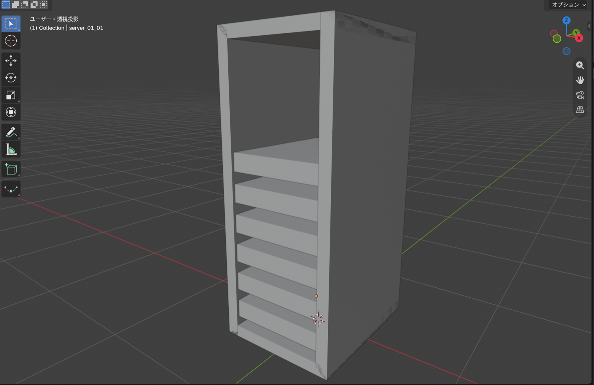
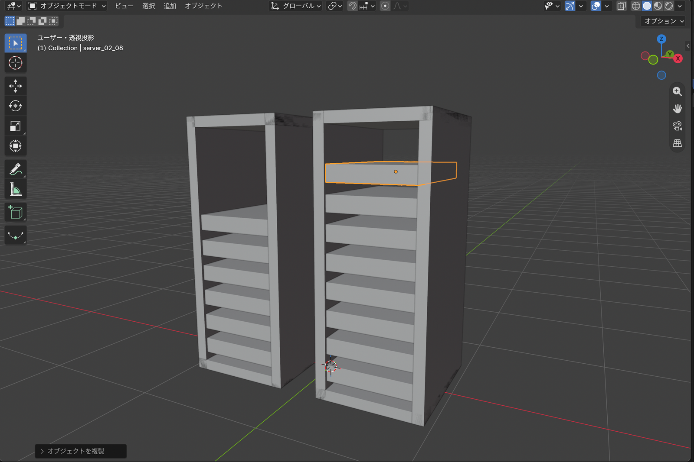
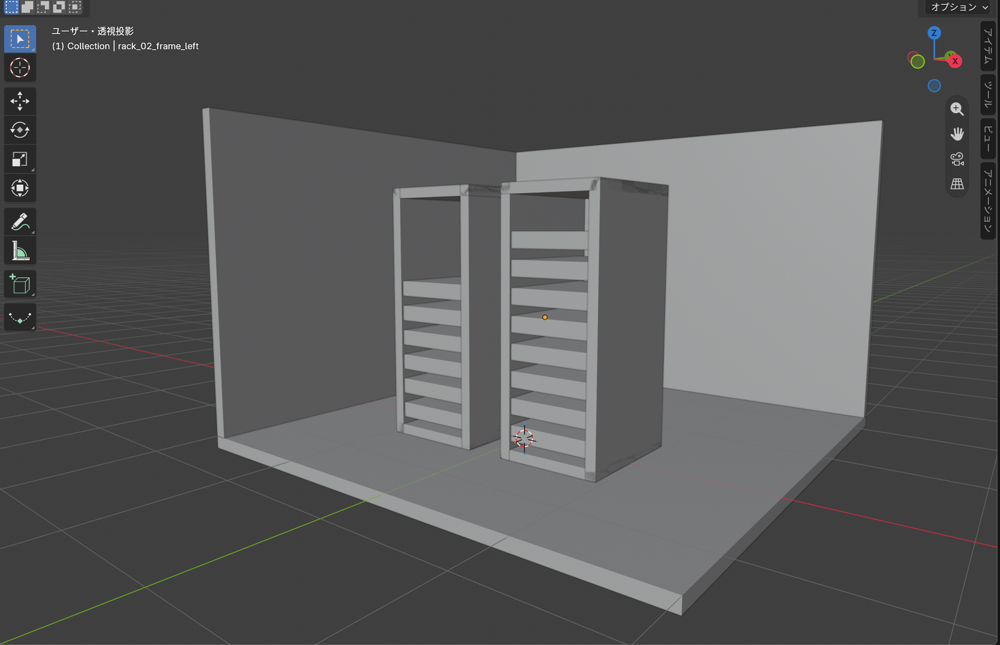
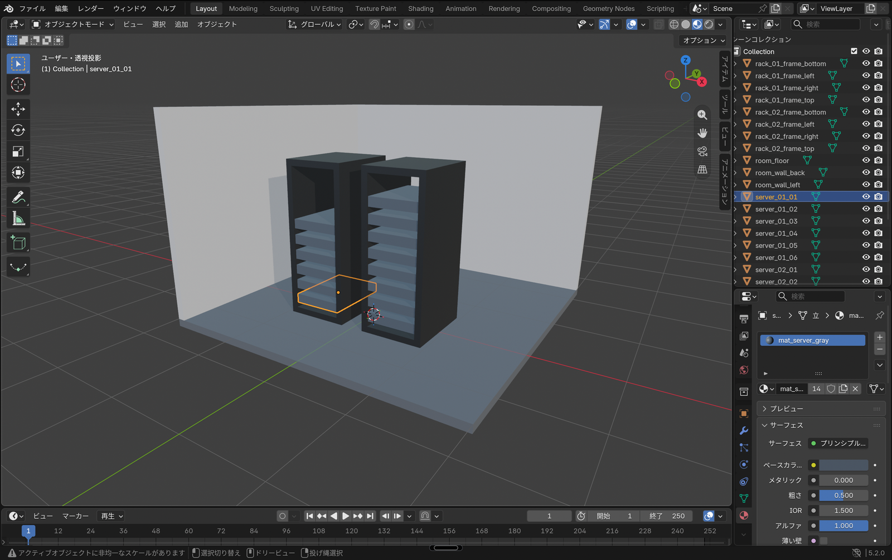
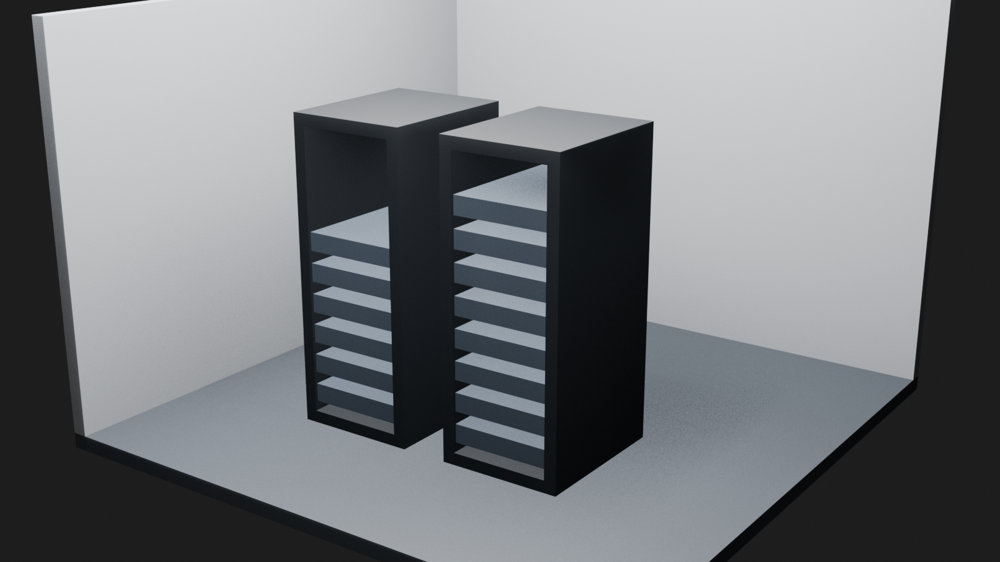

AIに操作方法を相談しながら進めることで、3D制作を始めるハードルが以前より下がったように感じています。そこで、Blenderを勉強しながら、ブラウザで動かせる3Dサーバールーム監視画面を作っています。

[第1回](/blog/blender-server-room-01-rack/)では、Cubeの変形と複製を使ってサーバーラックを1台作りました。今回はそのファイルを引き継ぎ、ラックを2台へ増やします。さらに床、壁、色、照明、カメラを追加し、部屋として見えるところまで進めます。

## 今回作るもの

第1回のラックを複製し、部屋の中央へ2台並べます。左のラックにはサーバーを6台、右のラックには8台置きました。


<span class="article-image-caption">図1：今回の出発点です。第1回で作った4個のフレームと6台のサーバーを引き継ぎます。</span>

部屋は床、奥の壁、左の壁で構成します。天井と右の壁を作らないのは、完成時にラックを見やすくするためです。仕上げには4種類のマテリアル、Area Light、Cameraを1個ずつ追加します。

作業環境は第1回と同じです。

- macOS 26.5.2
- Blender 5.2.0 LTS
- Apple Silicon搭載Mac
- Macのトラックパッド
- Blenderの日本語UI

## 第1回のファイルを別名で保存する

最初に`blender/episode-01-rack.blend`を開き、`ファイル > 名前を付けて保存`から`blender/episode-02-server-room.blend`として保存しました。第1回の完成ファイルを残したまま、続きを別のファイルで作るためです。

Blenderでは、ショートカットがポインターのある領域に対して働きます。以降のキー操作では、ポインターを3D Viewportの上に置いています。

## ラックを2台へ増やす

まず、既存ラックの10個のMeshをすべて選び、`G > X > -0.55`と入力して左へ移動しました。複数のオブジェクトを選択した状態でも、`G`でまとめて相対移動できます。

選択を維持したまま`Shift + D > X > 1.1`と入力し、ラック一式を右へ複製しました。左ラックの中心は`X = -0.55`、右ラックの中心は`X = 0.55`です。

右ラックには、サーバーをさらに2台追加しました。上にあるサーバーを`Shift + D > Z > 0.2`で複製し、高さ`Z = 1.4`と`1.6`へ配置しています。


<span class="article-image-caption">図2：ラック一式をX軸方向へ複製し、右側だけサーバーを8台へ増やした状態です。</span>

オブジェクト名は、左を`rack_01_*`と`server_01_*`、右を`rack_02_*`と`server_02_*`にそろえました。今回は数が多かったため、一括での名前変更はCodexに任せています。

## 床と2面の壁を作る

床と壁は、第1回と同じくCubeから作りました。`Shift + A > メッシュ > 立方体`でCubeを追加し、`N`キーで開くSidebarから位置と寸法を入力します。

| オブジェクト名   | Location X / Y / Z  | Dimensions X / Y / Z |
| ---------------- | ------------------- | -------------------- |
| `room_floor`     | `0 / 0.5 / -0.05`   | `4.0 / 4.0 / 0.1`    |
| `room_wall_back` | `0 / 2.45 / 1.3`    | `4.0 / 0.1 / 2.6`    |
| `room_wall_left` | `-1.95 / 0.5 / 1.3` | `0.1 / 4.0 / 2.6`    |

ラックの前面はY軸のマイナス方向です。奥と左だけに壁を置くと、右手前から室内を見渡せます。


<span class="article-image-caption">図3：床、奥の壁、左の壁を追加しました。まだマテリアルを設定していないため、全体が同じ灰色に見えます。</span>

## 4種類のマテリアルで色を分ける

次にMaterial Propertiesを開き、`新規`から4種類のマテリアルを作りました。色はPrincipled BSDFのBase Colorに16進数で入力しています。

| マテリアル名          | 対象             | 色        |
| --------------------- | ---------------- | --------- |
| `mat_wall_light_gray` | 奥と左の壁       | `#B8BCC2` |
| `mat_floor_gray`      | 床               | `#555B63` |
| `mat_rack_dark_gray`  | ラックのフレーム | `#22262B` |
| `mat_server_gray`     | サーバー         | `#4A5562` |

同じマテリアルを複数のオブジェクトへ割り当てる反復作業は、Codexに任せました。左の壁へ既存の壁用マテリアルを割り当てるときは、奥の壁を最後に選択してアクティブにし、`Control + L > マテリアルをリンク`も使っています。


<span class="article-image-caption">図4：マテリアルプレビューへ切り替えると、壁、床、ラック、サーバーの色を見分けられました。</span>

最初はソリッド表示のまま色を設定していたため、壁と床の違いがほとんど分かりませんでした。設定に失敗したように見えましたが、Viewport Shadingを`マテリアルプレビュー`へ切り替えると色を確認できました。マテリアルの値と、Viewportでの表示方法は別に考える必要があります。

## Area Lightで室内を照らす

`Shift + A > ライト > エリア`からArea Lightを追加し、`room_key_light`と名付けました。1個のライトでラック2台と床を広く照らすため、部屋の中央上部に置いています。

| 項目           | 設定値           |
| -------------- | ---------------- |
| Location       | `0 / -0.5 / 4.0` |
| Power          | `900 W`          |
| Shape          | `Square`         |
| Size           | `5.0 m`          |
| World Strength | `0.35`           |

ライトを増やさず、Area Lightの大きさとWorldの明るさを調整しました。今回の目的は照明演出ではなく、ラックの外枠と中のサーバーを見分けられる状態にすることです。

## Cameraで完成画面を決める

`Shift + A > カメラ`からCameraを追加し、`room_overview_camera`と名付けました。右手前の少し高い位置から、ラック2台、床、奥の壁、左の壁が入るようにしています。

| 項目     | 設定値                   |
| -------- | ------------------------ |
| Location | `4.8 / -6.5 / 3.6`       |
| Rotation | `72.028° / 0° / 35.218°` |
| Lens     | `50 mm`                  |

トラックパッドで見やすい視点を作り、`ビュー > 視点を揃える > アクティブカメラをビューに揃える`を試しました。ただ、Cameraをシーンで使う状態にする操作が分かりにくく、最後はCodexに位置、回転、レンズと使用カメラの設定を確認してもらいました。

## 名前の一括変更で上枠まで選んでしまった

Codexに任せた一括変更でも、最初から正しく処理できたわけではありません。右ラックの追加サーバーを探す条件を「右側にあり、Zが1.3より大きいMesh」としたところ、`Z = 1.96`にあるラックの上枠まで条件に含まれました。その結果、上枠が`server_02_08`に変わり、サーバーが9個あると判定されました。

保存後の検証で誤りを見つけ、上枠を`rack_02_frame_top`へ戻しました。そのうえで、`Z = 1.6`にあるMeshだけを`server_02_08`へ変更しています。AIに反復作業を任せる場合でも、条件が形の構造に合っているかを検証する必要があると分かりました。

## 完成確認

完成したサーバールームがこちらです。


<span class="article-image-caption">図5：右手前のCameraから見た完成状態です。左に6台、右に8台のサーバーを配置しています。</span>

`Command + S`で保存してBlenderを閉じ、`.blend`ファイルを開き直しました。ラック2台、サーバー14台、床、壁2面、マテリアル4種類、Area Light、Cameraが残っていることを確認しています。

さらに、Blenderをバックグラウンド起動して検証スクリプトを実行しました。

```sh
/Applications/Blender.app/Contents/MacOS/Blender \
  --background blender/episode-02-server-room.blend \
  --python scripts/verify_episode_02.py
```

結果は`EPISODE_02_OK`でした。オブジェクトの名前、位置、寸法、マテリアル、ライト、Cameraが予定した値と一致しています。

## 今回覚えた操作

- `ファイル > 名前を付けて保存`で元のファイルを残す
- `G > X > 数値`で複数のオブジェクトをまとめて移動する
- `Shift + D > X > 数値`で選択した一式を軸方向へ複製する
- `Option + A`で選択を解除する
- Material Propertiesでマテリアルを作る
- `Control + L > マテリアルをリンク`で同じマテリアルを共有する
- マテリアルプレビューで色を確認する
- Area Lightで広い範囲を照らす
- Cameraを追加して完成画面を決める

第1回では灰色のラックが1台あるだけでしたが、床と壁の中へ2台を並べ、色と照明を加えると部屋として見えるようになりました。AIに操作を相談したり反復作業を任せたりすると、初めて触る機能にも進みやすくなります。一方で、名前や数値を機械的に確認する工程は省かないほうが安心です。

## 次回

次回は、このサーバールームをWebブラウザで扱えるGLB形式へ書き出します。Blender内の見た目が書き出し後も保たれるかを確認し、Reactから表示する準備を進める予定です。
