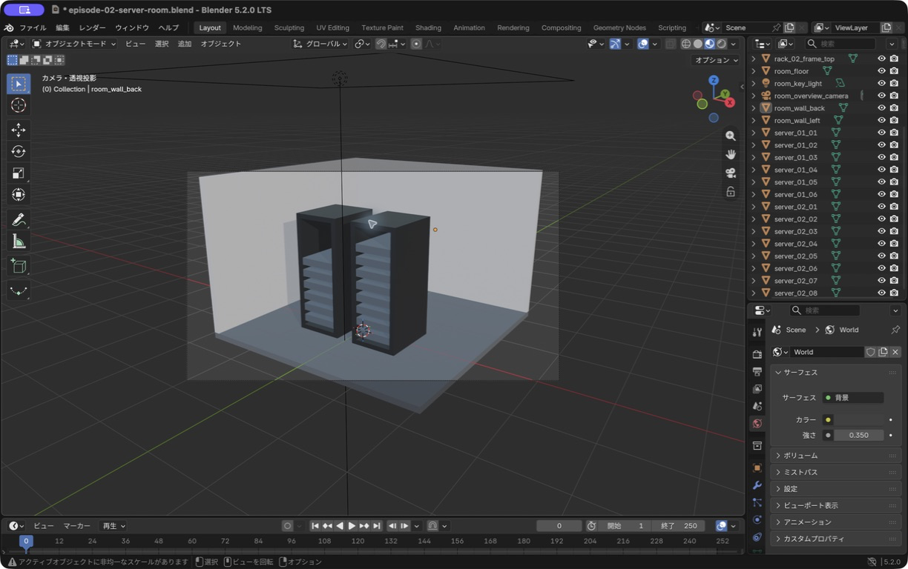
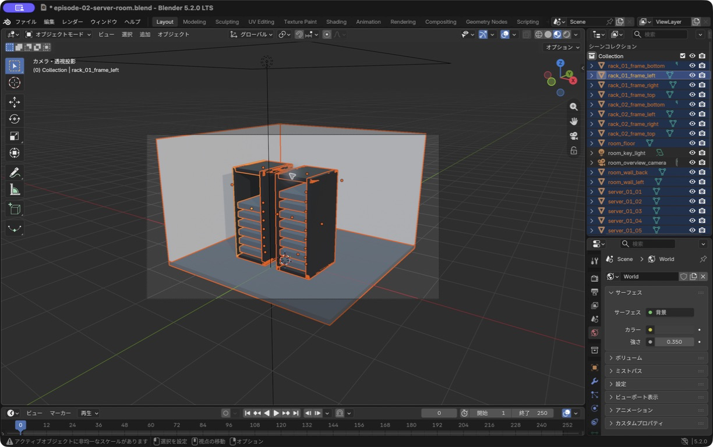
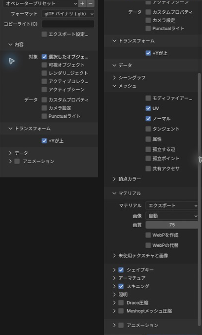
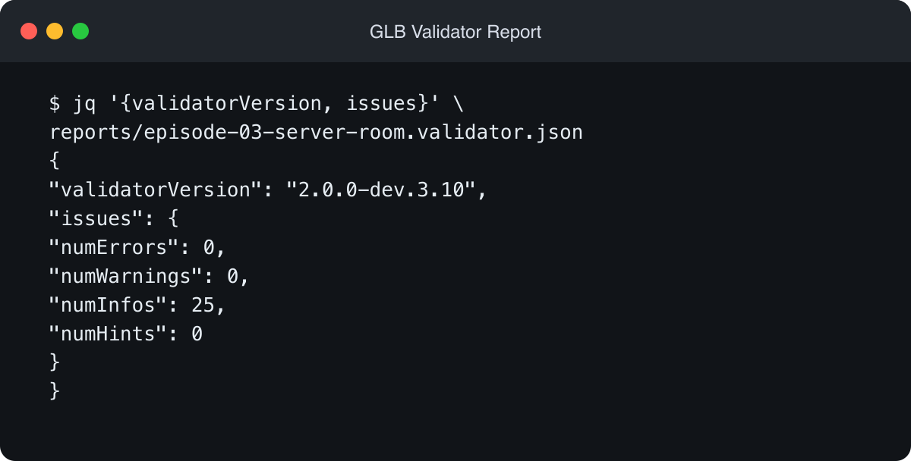
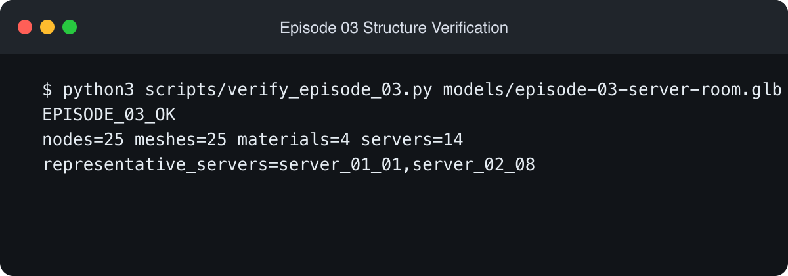
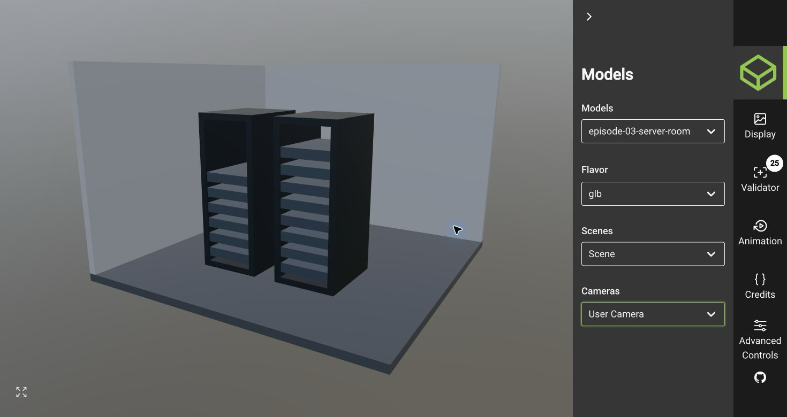

AIに操作を相談できるようになり、3D制作を始めるハードルは以前より下がったように感じています。そこで、Blenderを勉強しながら、ブラウザで動く3Dサーバールーム監視画面を作っています。

[第1回](/blog/blender-server-room-01-rack/)ではCubeからサーバーラックを作り、[第2回](/blog/blender-server-room-02-room/)では床と壁、2台目のラック、マテリアル、照明、カメラを追加しました。今回は完成した部屋をGLBファイルへ書き出し、Reactから読み込む前の確認を行います。

## 今回作るもの

第2回の`.blend`ファイルから、床、壁、ラック、サーバーを1個のGLBファイルへ書き出します。Reactでの表示や、アラームに応じた色の変更は次回に回し、今回はデータを正しく渡せる状態まで進めます。


<span class="article-image-caption">図1：第2回の完成ファイルです。床と壁2面、ラック2台、左6台と右8台のサーバーが入っています。</span>

作業環境は次のとおりです。

- macOS 26.5.2
- Blender 5.2.0 LTS
- Node.js 24.14.0
- Macのトラックパッド
- Blenderの日本語UI

## GLBファイル

`.blend`はBlenderで制作を続けるためのファイルです。オブジェクトのほか、作業用のCameraやLightもシーンに保存できます。

GLBは、3DモデルをWebアプリなどへ渡すときに使えるglTFのバイナリ形式です。形状、マテリアル、シーン構造などを1ファイルにまとめられるため、今回はReactで読み込む成果物として選びました。

書き出せたかどうかは、Blenderで見た目を確認するだけでは判断しません。形式、node名とマテリアル、ブラウザでの見た目を分けて調べます。

## 書き出すMeshの選択

今回は、床と壁2面、ラック8個のフレーム、サーバー14台の合計25個を選びました。いずれもMeshです。

選択数が多いため、CodexにBlenderのPython Consoleから`type == "MESH"`に一致するオブジェクトを選択してもらいました。その後、Outlinerと3D Viewportを見て、自分でもCameraとArea Lightが選択に含まれていないことを確認しています。


<span class="article-image-caption">図2：選択中のMeshがオレンジ色で表示されています。OutlinerではCameraとArea Lightが選択から外れています。</span>

CameraとLightを除いたのは、React側でカメラ操作と照明を用意する予定だからです。Blenderで完成画面を決めるために使った要素まで、GLBへ入れる必要はありません。

## glTF Binaryでの書き出し

`ファイル > エクスポート > glTF 2.0 (.glb/.gltf)`を開き、次のように設定しました。

| 項目                   | 設定                 |
| ---------------------- | -------------------- |
| Format                 | `glTF Binary (.glb)` |
| Selected Objects       | ON                   |
| Cameras                | OFF                  |
| Punctual Lights        | OFF                  |
| +Y Up                  | ON                   |
| Apply Modifiers        | OFF                  |
| Materials              | `Export`             |
| Draco Mesh Compression | OFF                  |
| Animations             | OFF                  |


<span class="article-image-caption">図3：選択したオブジェクトだけを書き出し、Camera、Light、Animation、Draco圧縮を含めない設定です。</span>

`Selected Objects`をONにすると、先ほど選んだ25個だけが対象になります。`+Y Up`はglTFの座標系に合わせるためONにしました。

今回は形状を変えるModifierもAnimationも使っていません。まずは非圧縮のデータを検証したかったため、Modifierの適用とDraco圧縮もOFFにしています。

ファイル名は`episode-03-server-room.glb`としました。容量は38,168 bytesでした。

## Khronos Validatorでの形式確認

GLBを書き出せても、ファイルの中にglTF仕様上の問題がないとは限りません。そこで、Khronos Groupが公開している`gltf-validator`を固定バージョンで導入し、JSONレポートを保存するスクリプトを用意しました。

```sh
npm ci
npm run validate:episode-03
```

使用したValidatorは`2.0.0-dev.3.10`です。結果はerrors 0、warnings 0、infos 25、hints 0でした。


<span class="article-image-caption">図4：保存したJSONレポートからValidatorのバージョンと件数を確認しました。エラーと警告は0件です。</span>

25件のinfoはすべて`UNUSED_OBJECT`で、各Meshに未使用のUV座標があるという内容でした。今回は画像テクスチャを使っていないため、UV座標が描画へ使われていません。エラーや警告ではなく、モデルの形やマテリアルの表示にも影響しないため、そのままにしています。

## node名とマテリアルの構造検証

ValidatorはglTFとして正しいかを調べられますが、このサーバールーム固有の名前や台数までは知りません。そこで、GLBのJSONチャンクを読むPythonスクリプトも作りました。

```sh
python3 scripts/verify_episode_03.py \
  models/episode-03-server-room.glb
```

このスクリプトでは、次の条件を確認しています。

- nodeとMeshが25個ずつあり、1対1で対応している
- マテリアルが4種類ある
- `server_01_*`が6台、`server_02_*`が8台ある
- Camera、Light、Animation、Draco圧縮を含まない
- 全サーバーへ`mat_server_gray`が割り当てられている


<span class="article-image-caption">図5：構造検証は`EPISODE_03_OK`でした。25 node、25 Mesh、4 material、14 serverを確認しています。</span>

代表として、最初の`server_01_01`と最後の`server_02_08`も出力しました。連番の両端を確認すると、書き出し時に名前が欠けたりBlenderの`.001`のような接尾辞が付いたりしていないことが分かります。

## Sample Viewerでの見た目

最後に、GLBを[Khronos glTF Sample Viewer](https://github.khronos.org/glTF-Sample-Viewer-Release/)へドラッグ＆ドロップしました。ブラウザ上でモデルを回転し、トラックパッドの2本指スクロールで拡大と縮小も試しています。


<span class="article-image-caption">図6：GLBをブラウザで開き、床、壁2面、ラック2台、サーバー14台の形と向きを確認しました。</span>

最初に開いた`glTF-Sample-Viewer`というURLは404でした。[公式リポジトリ](https://github.com/KhronosGroup/glTF-Sample-Viewer)を確認すると、現在の公開先はURLの末尾に`-Release`が付いていました。ブックマークや過去の記事にあるURLは変わることがあるため、開けないときは公式リポジトリからたどるのが確実です。

Viewerでは、床、壁、ラック、サーバーの4色を見分けられました。上下や前後の反転もありません。ただし、明るさはBlenderの画面と完全には一致しません。GLBへArea Lightを含めず、Sample Viewerが用意した環境光で表示しているためです。

## 共有マテリアルと次回の色変更

14台のサーバーは、1個の`mat_server_gray`を共有したまま書き出しました。同じマテリアルを共有すると、現在のように全台を同じ色で表示する用途には無駄がありません。

一方、Reactで共有マテリアルの色を直接変えると、同じマテリアルを使う14台すべての色が変わります。監視画面では、正常なサーバーは緑、アラーム中のサーバーは赤色というように、1台ずつ状態を表したいところです。

次回はGLBを読み込んだ後、各サーバーのマテリアルを複製してから色を設定します。今回のGLBに欠陥があるわけではなく、制作時は共有し、動的な表示を始める段階で分ける方針です。

## 今回覚えたこと

- `Selected Objects`で必要なMeshだけを書き出す
- CameraとLightをBlenderの作業用データとして残し、GLBからは除外する
- `glTF Binary (.glb)`で関連データを1ファイルにまとめる
- ValidatorでglTF形式のエラーと警告を調べる
- Pythonでプロジェクト固有のnode名、台数、マテリアルを調べる
- Sample Viewerでブラウザ上の形、色、向き、操作を確認する

BlenderからGLBを書き出す操作自体は短いものでした。今回はその後の確認に時間を使っています。AIに操作や検証スクリプトを相談できると、初めて扱う3D形式でも、画面で見た印象だけに頼らず少しずつ確かめられました。

## 次回

次回はReact Three FiberからこのGLBを読み込みます。まずブラウザ内で回転できる状態にし、その後、監視データを想定して特定のサーバーだけ色が変わるところまで作る予定です。
