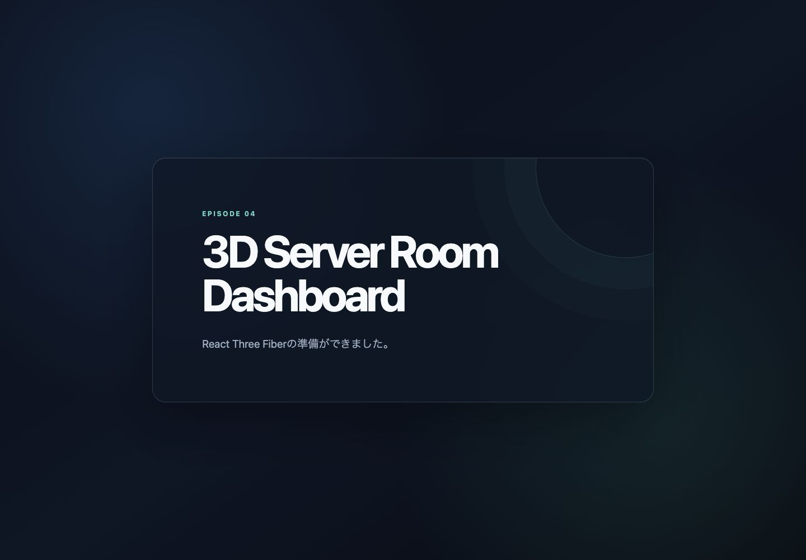
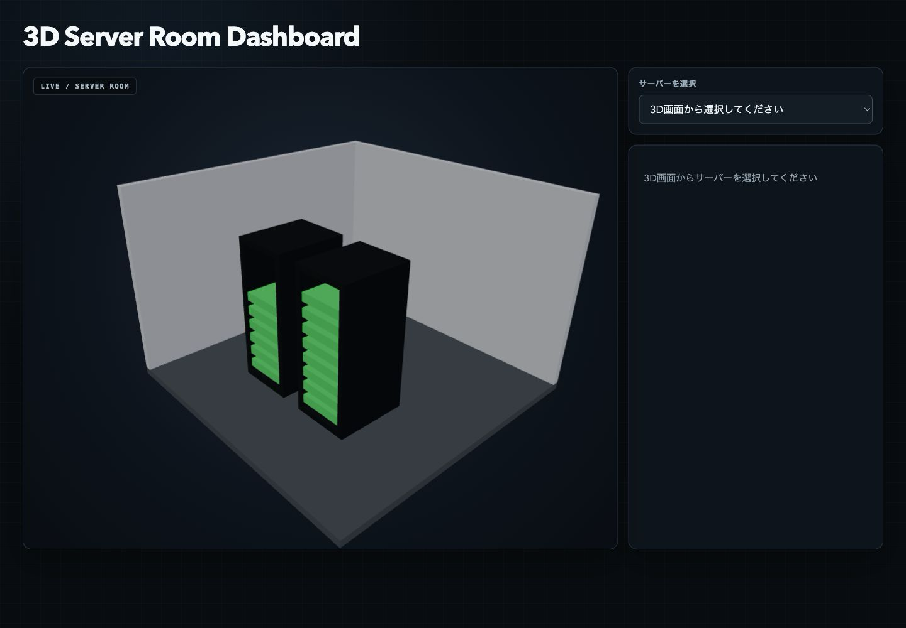
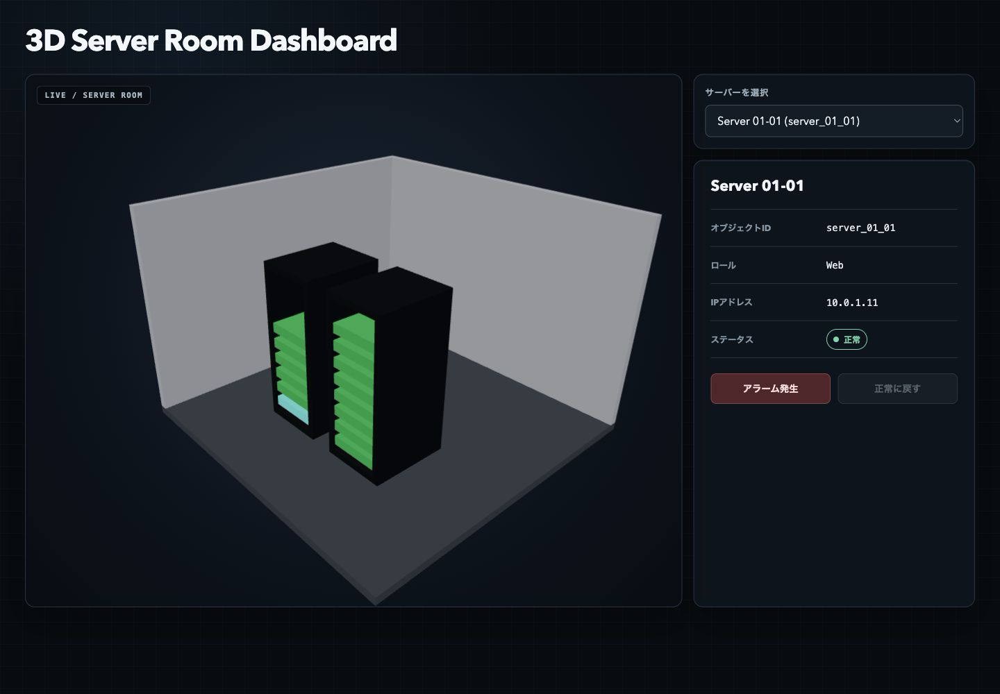
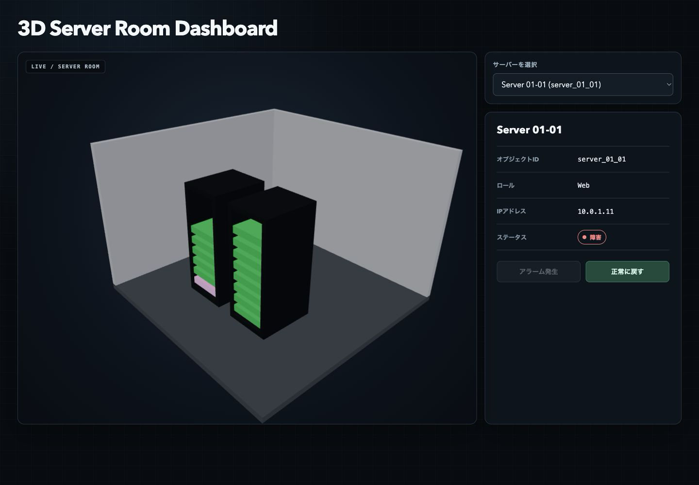

AIに操作やコードを相談できるようになり、3Dへのハードルが以前より下がっていると思い、Blenderの勉強を始めました。[第1回](/blog/blender-server-room-01-rack/)でサーバーラックを作り、[第2回](/blog/blender-server-room-02-room/)で部屋へ広げ、[第3回](/blog/blender-server-room-03-glb/)ではブラウザへ渡すGLBを書き出しました。

第4回ではBlender自体は触らず、第3回のGLBをReactで使います。ブラウザ上で3Dサーバールームを表示し、サーバーを選択して、アラームに応じて色を変えるところまで進めます。

## 今回作るもの

画面の左側に3Dサーバールーム、右側に選択したサーバーの詳細を表示します。マウスやトラックパッドで視点を回転・ズームでき、3D上のサーバーをクリックすると、名前、オブジェクトID、役割、IPアドレス、状態が右側へ出る構成です。

監視データは14台分のモックデータです。正常は緑、障害は赤で表し、「アラーム発生」と「正常に戻す」の2個のボタンで状態を切り替えます。


<span class="article-image-caption">図1：ViteとReactの起動を先に確認した画面です。この時点では3Dモデルをまだ読み込んでいません。</span>

## 第3回のGLBをReactへ配置する

第3回で作った`models/episode-03-server-room.glb`を、Viteが静的ファイルとして配信する`public/models/server-room.glb`へコピーしました。

```sh
mkdir -p public/models
cp models/episode-03-server-room.glb \
  public/models/server-room.glb
```

コピー後は2ファイルのSHA-256を比較し、内容が一致していることも確認しています。Blenderのソースや元のGLBは変更していません。

## Vite、React Three Fiber、Drei

既存のGLB検証用リポジトリへViteとReactを追加しました。3D描画にはThree.jsをReactのコンポーネントとして扱えるReact Three Fiberを使い、補助機能をまとめたDreiも導入しています。

```sh
npm install react react-dom three \
  @react-three/fiber @react-three/drei
npm install -D vite typescript
```

最初に通常のReact画面を表示し、Viteの開発サーバーとCSSが動くところまでを確認しました。その後に3D表示を足しています。初期設定とGLB読み込みを分けたので、どこまで動いているかを画面で追いやすくなりました。

## useGLTFでGLBを表示する

GLBの読み込みにはDreiの`useGLTF`を使いました。返されたシーンをReact Three Fiberの`primitive`へ渡すと、Blenderから書き出した階層を保ったままCanvasへ表示できます。

```tsx
function ServerRoomModel() {
  const { scene } = useGLTF('/models/server-room.glb');

  return <primitive object={scene} />;
}
```

Canvasにはカメラ、環境光、平行光源を置きました。第3回のGLBにはCameraとLightを含めていないため、この2つはReact側で用意しています。


<span class="article-image-caption">図2：床、壁2面、ラック2台、サーバー14台を表示した状態です。まだサーバーは選択していません。</span>

## OrbitControlsで視点を動かす

Dreiの`OrbitControls`をCanvasへ追加し、回転、ズーム、平行移動を有効にしました。注視点とカメラの最小・最大距離も決め、操作中にモデルを見失いにくくしています。

```tsx
<OrbitControls enableRotate enableZoom enablePan target={[0, 1.2, 0]} minDistance={2.5} maxDistance={12} />
```

実際のブラウザで回転とズームを試し、床や壁の向き、ラック2台の配置を確認しました。

## object nameからサーバーを選択する

第3回では、各サーバーに`server_01_01`から`server_02_08`までの名前を付けたままGLBへ書き出しました。今回はクリックイベントの`event.object.name`を読み、その名前を監視データのIDとして使います。

```tsx
function handleClick(event: ThreeEvent<MouseEvent>) {
  const serverId = toServerId(event.object.name);
  if (!serverId) {
    return;
  }

  event.stopPropagation();
  onSelect(serverId);
}
```

`toServerId`は`server_`から始まるかを見るだけでなく、14台の登録済みIDに含まれるかを確認します。そのため、床、壁、ラックをクリックしても選択状態は変わりません。

## 詳細パネルと14台のモックデータ

ローカルには14台分の名前、役割、IPアドレスを定義しました。たとえば`server_01_01`は`Server 01-01`、役割は`Web`、IPアドレスは`10.0.1.11`です。

3D Canvasだけではキーボードからサーバーを選びにくいため、ネイティブの`select`も追加しました。Canvasと`select`は同じ選択IDを参照します。

```tsx
<select
  value={selectedServerId ?? ''}
  onChange={(event) => {
    setSelectedServerId(toServerId(event.currentTarget.value));
  }}
>
  {SERVER_IDS.map((id) => (
    <option key={id} value={id}>
      {SERVERS[id].name} ({id})
    </option>
  ))}
</select>
```


<span class="article-image-caption">図3：Server 01-01を選択すると、オブジェクトID、Webという役割、IPアドレス、正常状態が表示されます。</span>

## 共有マテリアルをサーバーごとに複製する

第3回のGLBでは、14台のサーバーが1個の`mat_server_gray`を共有しています。読み込んだマテリアルの色をそのまま変えると、選択した1台だけでなく、共有している全台の色が変わる問題があります。

そこでシーンを準備するときに、各サーバーのマテリアルへ`material.clone()`を1回ずつ実行しました。複製後は、それぞれのサーバーが別のマテリアルを持つため、1台だけ色を更新できます。

```ts
const serverMaterials = sourceMaterials.map((material) => {
  return material.clone();
});
```

複製は再描画のたびに行わず、シーンの準備時だけにしています。コンポーネントを破棄するときは、React側で複製したマテリアルだけを`dispose()`します。

## アラームで緑から赤へ変える

状態は`healthy`と`critical`の2種類に絞りました。正常な`healthy`は`#22C55E`、障害の`critical`は`#EF4444`です。選択中のサーバーには、状態色とは別に水色の発光を加えます。

```ts
const STATUS_VISUALS = {
  healthy: { label: '正常', color: '#22C55E' },
  critical: { label: '障害', color: '#EF4444' },
} as const;
```

14台の状態はReactの`useState`で保持します。「アラーム発生」を押すと選択中のIDだけを`critical`へ変え、「正常に戻す」を押すと`healthy`へ戻します。


<span class="article-image-caption">図4：選択中のServer 01-01だけを障害へ切り替えました。詳細パネルにも赤い状態表示と「障害」の文字が出ています。</span>

この段階では、AWSやCloudWatch、監視APIには接続していません。状態はブラウザ内のローカルstateだけにあり、ページを再読み込みすると初期状態へ戻ります。

## 読み込み経路とProduction build

GLBの取得には時間がかかる場合があるため、読み込み中は`Suspense`のfallbackで「3Dモデルを読み込んでいます」と表示します。読み込み失敗はError Boundaryで受け取り、「3Dモデルを読み込めませんでした」と`/models/server-room.glb`の確認案内を出す経路も用意しました。

自動検査では、14台のID、状態色、詳細パネル、マテリアルの複製、GLBの一致などを確認しています。最後に次のコマンドを実行しました。

```sh
npm run lint
npm test
npm run validate:episode-03
npm run build
```

TypeScriptとViteのProduction buildは成功しました。実ブラウザでも`server_01_01`と`server_02_08`を選択し、回転、ズーム、アラーム発生、正常復帰を確認しています。

一方、build時にはThree.jsとReact Three Fiberを含むチャンクが500KBを超えるという警告が出ています。今回はローカルで機能をつなぐところまでとし、チャンク分割は今後の改善点として残しました。

## 4回のまとめ

4回を通して、Cubeから作ったラックを部屋へ広げ、GLBとして書き出し、Reactの監視状態とつなぎました。第4回ではBlenderを開いていませんが、第3回までにそろえたオブジェクト名とGLBが、React側の選択や状態変更にそのまま役立ちました。

今の監視画面はローカルのモックデータで動く段階です。次に進めるなら、JSONやAPIから状態を取得する構成へ置き換え、CloudWatchなど実際の監視データとの連携を検討します。
