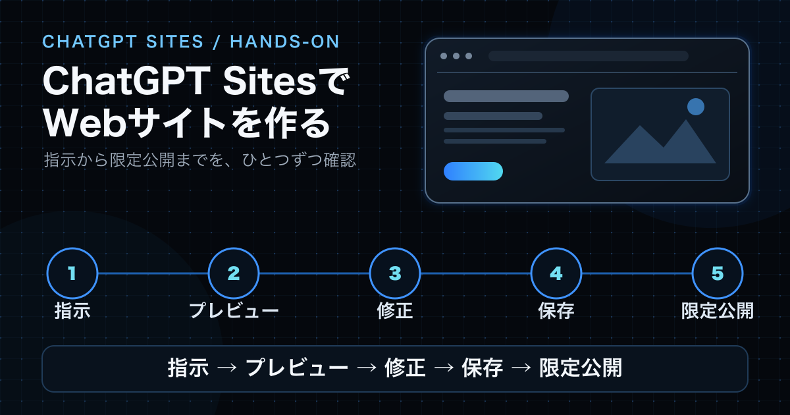
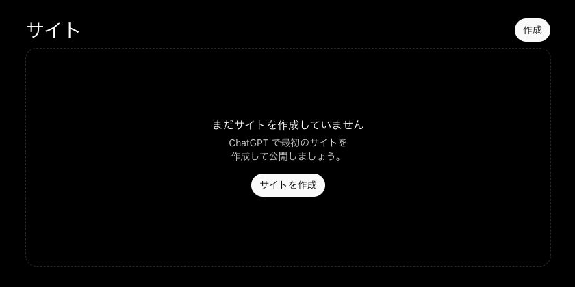
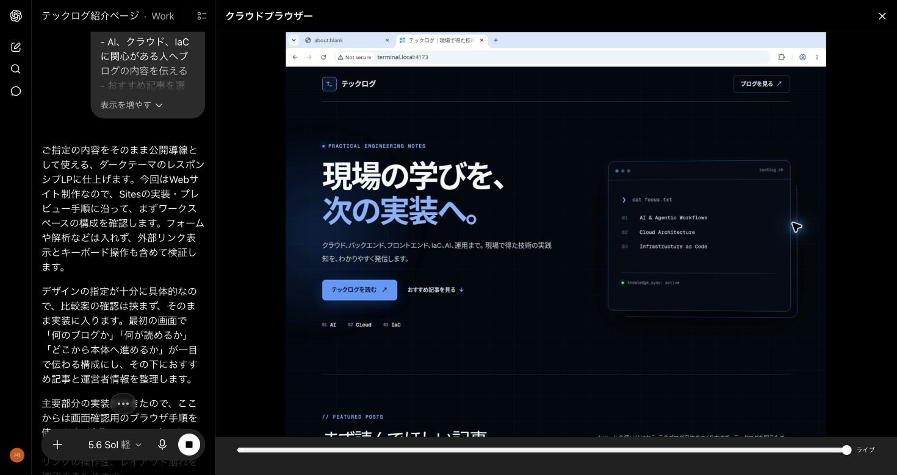
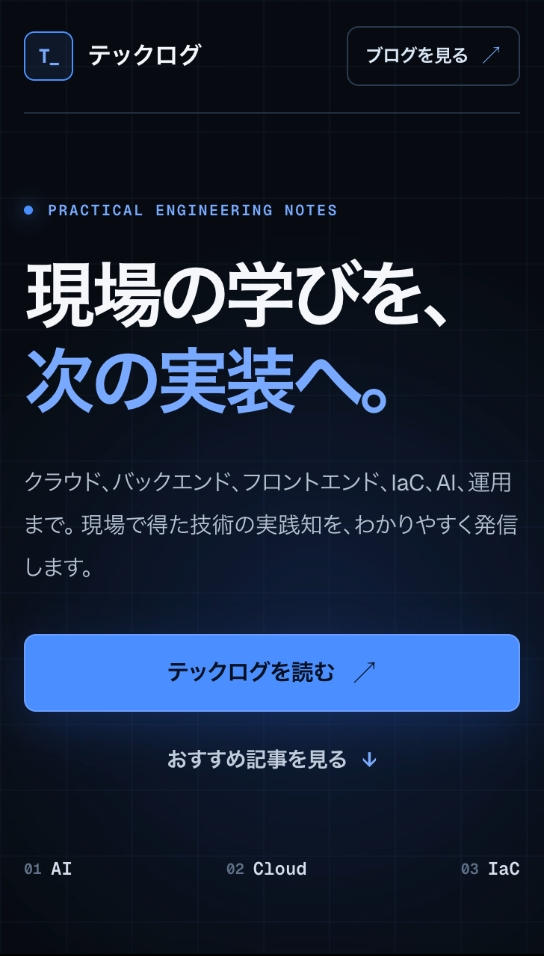
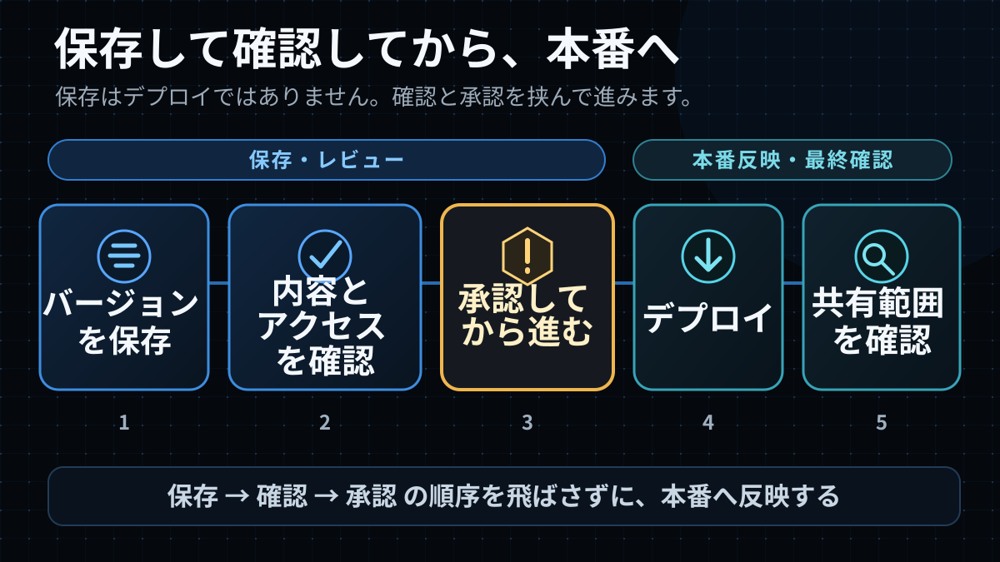
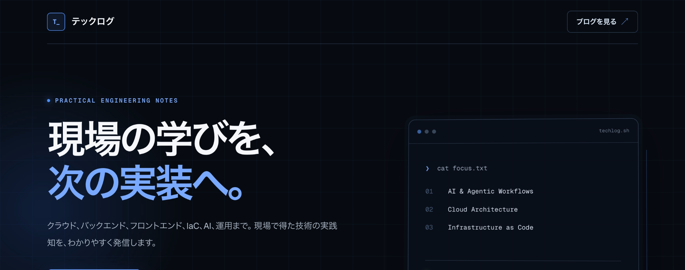
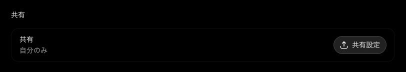

ChatGPT Sitesでは、指示からWebサイトを作り、ホストし、会話で修正して共有まで進められます。ただし、生成結果をそのまま公開せず、本文とリンク、モバイル表示、秘密情報、共有範囲を人が確認する必要があります。この記事では、生成から「自分のみ」での共有範囲確認までを実際にたどります。

この記事の公式情報は**2026-07-14時点**で確認し、実演は**2026-07-15**に完了しました。SitesはPublic Betaのため、画面や提供条件は今後変わる可能性があります。本文では、OpenAIが説明している内容を「公式仕様」、実際の画面で確かめた内容を「実演結果」、使い方に関する提案を「筆者の判断」と分けて記します。


<span class="article-image-caption">図1：指示、プレビュー、修正、保存を経て、「自分のみ」での限定公開まで確認した全体像です。</span>

## ChatGPT Sitesで何ができるのか

**公式仕様：** [Sitesの公式ガイド](https://learn.chatgpt.com/docs/sites)では、WebサイトやWebアプリ、ゲームを作成し、ホスト、修正、共有できる機能として説明されています。2026-07-14時点ではPublic Betaで、利用可否はプラン、地域、Workspaceの設定に左右されます。現在の提供条件は[公式のPricing案内](https://learn.chatgpt.com/docs/pricing)で確認してください。

固定的な料金表はこの記事に載せません。[学生向けサイトの作成例](https://learn.chatgpt.com/use-cases/build-student-website)は、指示からサイトを組み立てる流れを把握する参考になります。

Sites上にホスト先があっても、自動的に一般公開されるわけではありません。誰が開けるかは共有範囲で決まるため、公開前に本番側の状態と共有範囲を確認することが、この記事で最も大切な点です。

## 今回作るもの

作るのは、技術ブログ「テックログ」を初めて訪れた人向けの小さなランディングページです。サイトの説明、三つのテーマ、おすすめ記事3件、運営者プロフィール、ブログへの導線を一つのページにまとめます。公開済みの文章とURLだけを使い、デスクトップとモバイルの両方で読めることを完了条件にしました。

**筆者の判断：** 最初の実演は、状態を持たないページに絞るのが適切です。今回はフォーム、ログイン・認証、外部API、アクセス解析、ファイルアップロード、データ保存を扱いません。運用データや利用者情報を扱う機能は、権限、保管先、障害時の対応まで別途設計する必要があるためです。

## 作る前に情報をそろえる

生成前に、目的、掲載文、実在するリンク、見た目、モバイル対応、アクセシビリティの条件を一つにまとめます。先に条件を整理しておけば、曖昧な指示を後から何度も直さずに済み、変えてよい部分と維持する部分も明確になります。

実演で最初に送ったプロンプトは次のとおりです。

```text
「テックログ」を初めて訪れた人向けの紹介ランディングページを作ってください。

目的:
- AI、クラウド、IaCに関心がある人へブログの内容を伝える
- おすすめ記事を選び、公開中のテックログへ移動してもらう

掲載内容:
- サイト名: テックログ
- 説明: クラウド、バックエンド、フロントエンド、IaC、AI、運用まで。現場で得た技術の実践知を、わかりやすく発信します。
- 主なテーマ: AI、Cloud、IaC
- 運営者: Hiroshi Imaizumi
- プロフィール: クラウド、バックエンド、フロントエンド、IaC、AI、運用の実践から得た知見を、技術ブログとして記録しています
- プロフィールページ:
  https://tech-log.hiroshiimaizumi0611.workers.dev/about/
- おすすめ記事:
  1. ChatGPTとCodexのPluginsとは？Apps・Skillsとの違い、探し方、権限の見方
     https://tech-log.hiroshiimaizumi0611.workers.dev/blog/chatgpt-codex-plugins-guide/
  2. ChatGPT Workとは？Chat・Codexとの違いと使い分け
     https://tech-log.hiroshiimaizumi0611.workers.dev/blog/chatgpt-work-guide/
  3. 2026年版 Astroで技術ブログを構築した
     https://tech-log.hiroshiimaizumi0611.workers.dev/blog/build-tech-blog-with-astro-2026/
- ブログを見るボタン:
  https://tech-log.hiroshiimaizumi0611.workers.dev/

デザイン:
- ダークテーマと青いアクセント
- 技術ブログらしい落ち着いた印象
- 日本語本文を読みやすくする
- DesktopとMobileの両方へ対応する

品質条件:
- 見出しを順序立てる
- キーボードだけで主要リンクを操作できるようにする
- 文字と背景に十分なコントラストを持たせる
- 外部リンクだと分かる表現にする
- Aboutページのメールアドレスや問い合わせ情報は転載しないでください。掲載する運営者情報は、上記の氏名とプロフィール文だけにしてください。
- 問い合わせフォーム、ログイン・認証、外部API、アクセス解析、ファイルアップロード、データ保存は追加しない。メールアドレス、秘密情報、非公開URLは掲載しない
```

**実演結果：** この初回プロンプトには、公開しないという指示がありませんでした。その後の会話で、Sitesは`最終版を公開します。`と表示しました。実演では応答を停止し、共有範囲を広げる操作には進んでいません。

履歴を正しく残すため、上のプロンプトは後から書き換えていません。読者が試す場合は、送信前に「公開・デプロイ、共有設定や権限の変更を行わない」という一文を独立して加えてください。生成と公開の境界を最初から明示できます。

## 最初のページを生成する

Sitesの開始画面でプロンプトを送ると、ページの生成とプレビューが始まります。この時点では公開ボタンを押さず、まず結果を確認します。


<span class="article-image-caption">図2：2026-07-14撮影。Sitesを開始する位置を示す画面です。Public BetaのためUIは変わる可能性があります。</span>

**実演結果：** 初回のデスクトップ表示には、指定したサイト名、説明、主要テーマ、おすすめ記事、運営者情報、行動を促す主要ボタン（CTA）が入りました。指定した公開URLも反映されています。見た目が整っていても、これだけで完成とは判断しません。


<span class="article-image-caption">図3：2026-07-14撮影。初回のヒーロー、サイト名、レイアウトを確認する画面です。UIは変わる可能性があります。</span>

## 見た目より先に内容と操作を確認する

確認は文章とリンクから始めます。サイト名、説明、記事タイトル、プロフィールが指定どおりか、各リンクが意図した公開URLを指すかを調べます。その後に見出し順、主要ボタン、キーボード操作、文字と背景のコントラストを確認します。最後に、メールアドレス、秘密情報、非公開URLなど、指示していない情報が混ざっていないかを見ます。

**実演結果：** デスクトップには依頼した内容が表示された一方、幅390px前後のモバイルプレビューでは本文が空白になりました。サイト名、ヒーロー見出し、説明、主要ボタン、おすすめ記事を確認できません。本文が空白になることは確認しましたが、その画面は公開用スクリーンショットとして保存していません。ここでは「雰囲気をよくする」のではなく、モバイルで本文を描画することを修正対象にしました。

## 修正プロンプトは具体的に書く

修正指示には、対象、現在の問題、変更内容、維持するもの、受け入れ条件、禁止事項を入れます。実際に送ったプロンプトをそのまま掲載します。

```text
対象: Mobile表示（幅390px前後）。

現在の問題:
- Mobile幅でプレビューしたところ、サイト本文が空白になり、サイト名、ヒーロー見出し、説明、主要CTA、おすすめ記事を確認できませんでした。

変更内容:
- 390px幅でも本文が確実に描画されるよう、レスポンシブCSSとレイアウトを修正してください。
- ヘッダー、ヒーロー、CTA、おすすめ記事カード、運営者プロフィール、最終CTAを1カラムで自然な順序に並べてください。
- 横スクロールを発生させず、ヒーローの装飾が本文やリンクを覆わないようにしてください。

維持するもの:
- Desktop版のダークテーマ、青いアクセント、落ち着いた技術ブログの印象
- 既存の日本語本文、Hiroshi Imaizumiの氏名と指定プロフィール文
- 指定したプロフィールURL、3件の記事タイトルとURL、ブログURL
- 見出し順序、外部リンク表現、キーボード操作、十分なコントラスト

受け入れ条件:
- 390×844のMobile表示で、サイト名、H1、説明、主要CTAが最初の画面内に読み取れる
- おすすめ記事3件が1列で表示され、各リンクがタップ・キーボード操作できる
- 運営者プロフィールと最終CTAが本文の後に表示される
- 横方向のオーバーフローがない
- Desktop表示を崩さない

禁止事項:
- Aboutページのメールアドレスや問い合わせ情報を転載しない
- メールアドレス、秘密情報、非公開URLを掲載しない
- フォーム、ログイン・認証、外部API、アクセス解析、ファイルアップロード、データ保存を実装しない
- 公開・デプロイ、共有設定や権限の変更を行わない
```

**実演結果：** 修正後、プレビュー領域の表示幅とコンテンツ全体の幅は、どちらも364pxでした（`clientWidth=364`、`scrollWidth=364`）。両者が一致したため、横方向のはみ出しはありません。記事カード3件、プロフィール、最終ボタンは、画面下とページ構造（DOM）で確認しました。図4にはすべて写っていませんが、デスクトップの構成も保たれています。


<span class="article-image-caption">図4：2026-07-14撮影。モバイル表示を修正し、最初の画面とヒーローを確認した結果です。この画面を公開用に保存しました。UIは変わる可能性があります。</span>


<span class="article-image-caption">図5：バージョンを保存し、内容とアクセスを確認して、承認後に本番側の状態と共有範囲を確かめる流れ。</span>

[図5を原寸で開く](/blog-assets/chatgpt-sites-save-vs-deploy.svg)


<span class="article-image-caption">図6：2026-07-14撮影。モバイル修正後もデスクトップ表示が保たれたことを再確認する画面です。UIは変わる可能性があります。</span>
[図6を原寸で開く](/blog-assets/chatgpt-sites-finished.png)

## 公開前にバージョンを保存する

公式ガイドでは、バージョン保存とデプロイを別の段階として説明しています。この記事でいう保存は、公開候補を確定してレビューするための指示です。ただし、今回の画面には、保存後に押す独立した「Deploy」ボタンはありませんでした。必ず別の手動デプロイがあるとは限らないため、保存後も本番側の状態と共有範囲を確認します。

実演では、次の保存専用指示を送りました。

```text
現在の修正済みページを、公開候補のバージョンとして保存してください。公開・デプロイは行わないでください。共有設定や権限を変更しないでください。現在の「自分だけが閲覧可能」な状態を維持してください。保存後は、保存できたことと、公開・デプロイを行っていないことだけを報告してください。
```

返答は`保存できました。公開・デプロイは行っていません。`でした。画面上の公開範囲も「自分だけが閲覧可能」のままで、この段階では共有設定を変更していません。


<span class="article-image-caption">図7：2026-07-14撮影。公開候補を保存した際の返答です。実際の本番側の状態は、この後に設定画面で確認しました。</span>
[図7を原寸で開く](/blog-assets/chatgpt-sites-saved-version.png)

**公式仕様：** APIキーなどの秘密情報は、プロンプト、ファイル、サイトのコンテンツ、`.openai/hosting.json`に入れません。

**筆者の方針：** この実演では、メールアドレス、問い合わせ情報、非公開URLも扱いません。公開情報だけで紹介ページを作るという範囲に合わせた追加ルールです。

## 本番URLと共有範囲を確認する

**実演結果：** 保存版の本番反映について承認を得た後、対象が「テックログ紹介」であることと、共有範囲が「自分のみ」であることを再確認しました。実際の選択肢は「自分のみ」と「リンクを知っている全員」の二つです。リンク共有への変更は別途承認されていないため、後者は選んでいません。

設定画面には、Sitesが自動的に用意した専用の本番URLと「アクセス」が表示されていました。一方、この時点の画面には、保存済み候補を改めて反映する別個の「Deploy」ボタンはありませんでした。そのため、新しいデプロイ操作は実行していません。設定の再保存や共有範囲の変更も行わず、すでに存在していた本番側の状態を確認して記録しました。

ホスティングしただけで自動的に一般公開されるわけではありません。専用URLが存在していても、誰が開けるかは共有範囲で決まります。


<span class="article-image-caption">図8：2026-07-15撮影。URLやアカウント情報を除き、共有範囲が「自分のみ」である部分だけを記録しました。</span>

ChatGPTの認証情報を付けずに本番URLへHTTPリクエストを送ると、サーバーは未認証を示す401で拒否しました。所有者の画面ではページを確認できますが、認証されていない第三者は開けません。この確認は「リンクを知っている全員」への共有テストではありません。リンク共有へ広げる場合は、対象とリスクを示したうえで別の明示承認が必要です。

今回の画面に、プランや管理者設定による追加の制限を示す表示はありませんでした。招待した相手だけ、またはWorkspaceだけに共有する選択肢も表示されませんでした。選択肢は環境で変わる可能性があるため、名称を推測して操作せず、実際の設定画面で最も狭い範囲を確認してください。

## Sitesは小規模な紹介ページ向きだが、公開前確認は欠かせない

**筆者の判断：** Sitesは、小さなランディングページ、試作、内容中心の紹介サイトを短時間で形にする用途と相性がよいと感じました。文章、リンク、レイアウトを会話で直し、候補を保存できるためです。

一方、生成結果をそのまま公開できるとは限りません。今回もデスクトップには内容が入りましたが、モバイルは空白でした。Sitesがページとホスト先を用意しても、人による確認は必要です。本文とリンク、モバイル表示、キーボード操作、コントラスト、秘密情報の混入、アクセス範囲を確認します。

認証、データ保存、外部API、フォーム送信、決済、継続的な監視や障害対応を伴う運用サイトは今回の対象外です。これらは権限、データ保護、監視、復旧まで含めて別途設計してください。

## 公開前チェックリスト

公開の承認を求める前に、次を一度ずつ確認します。

- 文章、氏名、記事タイトルが指定した公開情報と一致している
- すべてのリンク先が正しく、外部リンクだと分かる
- デスクトップで見出し、本文、主要ボタンが読める
- モバイルで本文が表示され、横スクロールがない
- キーボードだけで主要リンクを操作できる
- 文字と背景に十分なコントラストがある
- メールアドレス、秘密情報、非公開URLが含まれていない
- 公開候補のバージョンを保存した
- 実際の共有範囲を確認し、デプロイを行う場合は対象と範囲を示して別の明示承認を得る
- 未認証ユーザーが意図どおり拒否されることを確認した

今回の実演では、内容確認、モバイル修正、バージョン保存、共有範囲の確認まで進めました。設定は「自分のみ」のままで、未認証アクセスが拒否されることも確認しています。Sitesでページを生成できても、内容、モバイル表示、秘密情報、共有範囲を確かめてから公開を判断してください。リンクを知る人へ共有範囲を広げる操作は行っていません。
