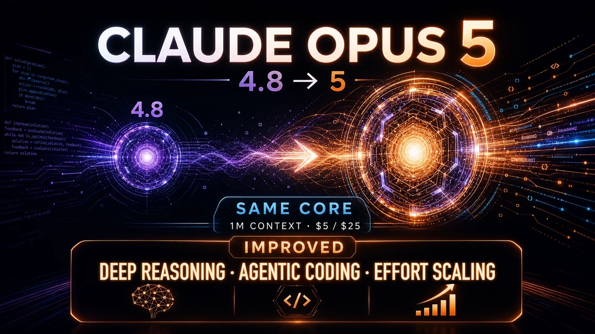

Claude Opus 5は、Anthropicが2026年7月24日に公開したOpus 4.8の後継モデルです。API単価を据え置きながら、深い推論、長時間のエージェント作業、コーディングを強化しています。

この記事では、2026年7月26日時点の[公式発表](https://www.anthropic.com/news/claude-opus-5)とClaude Platformの資料を基礎に、Artificial Analysisの第三者評価を分けて整理します。ハンズオンやOpus 4.8との実機比較は実施していません。



<!-- prettier-ignore -->
*Opus 4.8から据え置かれた条件と、Opus 5で強化された領域を表したテックログのオリジナル画像*

## Claude Opus 5とは

Claude Opus 5は、複雑なエージェント型コーディングと企業の知識業務を主な用途とする上位モデルです。長い手順を追う分析や、複数ファイルにまたがる実装を一度の作業として進める場面が想定されています。[Opus 5の公式仕様](https://platform.claude.com/docs/en/about-claude/models/whats-new-opus-5)に記載されたAPIモデルIDは`claude-opus-5`です。

ClaudeのプランではClaude Maxのデフォルトモデルとなり、Claude Proで利用できるモデルのうち最上位に位置します。開発者はClaude APIに加え、Amazon Bedrock、Google Cloud、Microsoft Foundryからも利用できます。クラウドごとにモデルIDや提供機能が異なるため、APIの文字列をそのまま流用できるとは限りません。

## Opus 4.8から強化された内容

Anthropicは、深い推論、長時間作業、追加の計算量を性能へつなげるeffort scalingを主な改善点に挙げています。`thinking`は回答前に内部で推論する仕組みで、`effort`は推論やツール利用へどの程度力をかけるかの設定です。`effort scaling`は、設定を上げたときの追加計算を性能向上につなげる性質を意味します。

`low`や`medium`でもトークンと待ち時間を抑えながら品質を保ちやすくなり、コードレビュー、画像理解、長い入力の処理、文書作成、複数エージェントの調整も強化されました。比較元となる[Opus 4.8の新機能ページ](https://platform.claude.com/docs/en/about-claude/models/whats-new-claude-4-8)は、2026年7月26日時点では前述のOpus 5ページへ転送されます。

APIで先に注意したい差は次のとおりです。

| 項目                   | Opus 4.8           | Opus 5                | 移行時の意味                                   |
| ---------------------- | ------------------ | --------------------- | ---------------------------------------------- |
| APIモデルID            | `claude-opus-4-8`  | `claude-opus-5`       | 呼び出し先を変更する                           |
| thinking               | 明示しなければ無効 | デフォルトで有効      | 同じリクエストでも思考トークンを使う場合がある |
| effort                 | 利用可能           | 5段階をより性能へ反映 | `high`を基準に実測する                         |
| thinkingの無効化       | effortと独立       | `high`以下だけ        | `xhigh`・`max`との併用は400エラーになる        |
| キャッシュ対象の最小長 | 1,024トークン      | 512トークン           | 短いプロンプトもキャッシュしやすい             |

[effortの公式資料](https://platform.claude.com/docs/en/build-with-claude/effort)では、`low`、`medium`、`high`、`xhigh`、`max`の5段階を選べます。既定値の`high`から始め、品質が保てるなら下げ、難しい仕事だけ上げるのが基本です。`max`は常に得になる設定ではなく、簡単な処理ではトークン消費や考え過ぎが増えることがあります。

会話の途中で利用可能なツールを変える機能はOpus 5の公開時期にベータとして案内されましたが、Opus 4.8でも使えます。条件とベータヘッダーは[会話中のツール変更に関する公式資料](https://platform.claude.com/docs/en/build-with-claude/mid-conversation-system-messages)で確認できます。[Fast mode](https://platform.claude.com/docs/en/build-with-claude/fast-mode)も両モデルに対応する継続機能です。出力トークンの生成速度は最大約2.5倍、料金は100万トークン当たり入力$10、出力$50で、2026年7月26日時点ではClaude APIだけの研究プレビューです。

応答の癖も変わります。Opus 5は回答や文書が長めになり、作業中の進捗を説明し、サブエージェントへ委任する頻度が高いとAnthropicは説明しています。自発的な検証も増えたため、旧モデル向けの再検証指示を残すと、確認が重なって時間とトークンを余計に使う可能性があります。[Opus 5のプロンプトガイド](https://platform.claude.com/docs/en/build-with-claude/prompt-engineering/prompting-claude-opus-5)には、長さ、進捗説明、委任数を制御する例があります。

## 料金と基本仕様はOpus 4.8から据え置き

[Claudeのモデル一覧](https://platform.claude.com/docs/en/about-claude/models/overview)で示される標準API単価と上限は、Opus 4.8とOpus 5で同じです。コンテキストウィンドウは、入力と会話履歴、thinkingを含む生成出力を一度に扱える合計の上限です。

| 仕様                   |           Opus 4.8 |             Opus 5 |
| ---------------------- | -----------------: | -----------------: |
| 入力料金               |  $5／100万トークン |  $5／100万トークン |
| 出力料金               | $25／100万トークン | $25／100万トークン |
| コンテキストウィンドウ |      100万トークン |      100万トークン |
| 最大出力               |       128kトークン |       128kトークン |

単価が同じでも、1回の費用まで同じになるとは限りません。Opus 5ではthinkingが既定で有効になり、effortを上げるほど思考、ツール呼び出し、本文に使うトークンが増える場合があります。総費用と所要時間は、入力長と出力長だけでなく、thinkingとeffortを含む実際の処理で比べる必要があります。

## ベンチマークは公式評価と第三者評価を分けて読む

まずAnthropicの公式評価です。[公式発表](https://www.anthropic.com/news/claude-opus-5)によると、コーディングを含む多領域の難しいエージェント作業を測るFrontier-Bench v0.1では、Opus 4.8の性能を2倍以上に伸ばしました。未知の環境を探索して適応する対話型推論を測るARC-AGI 3では、スコアが次点モデルの3倍でした。

日常業務や専門業務にまたがる長時間のPC操作を測るOSWorld 2.0では、Fable 5の最高結果を上回り、1タスク当たりの費用は3分の1強です。実際のCursorセッションを基にした曖昧な複数ファイル課題でコーディングエージェントを測るCursorBench 3.2では、`max`設定でFable 5の最高スコアとの差が0.5%以内、費用は約半分でした。

これらは開発元が選んだ条件で測ったベンダー評価です。強化された領域を知る材料にはなりますが、自社のコード、資料、合格基準で同じ差が出る保証はありません。

次に第三者評価を見ます。Artificial Analysisが2026年7月24日に公開した[Opus 5のAA-Briefcase評価](https://artificialanalysis.ai/articles/claude-opus-5-leader-agentic-knowledge-work)は、数千の入力ファイルを使い、調査レポート、スライド、表計算などの成果物を作らせるエージェント型の知識業務ベンチマークです。Eloは、高いほど他モデルとの相対評価が高い指標です。

| AA-Briefcaseの指標 | Opus 5 max |             比較対象 |
| ------------------ | ---------: | -------------------: |
| 総合Elo            |       1720 |        Fable 5: 1574 |
| 1タスク当たり費用  |     $17.79 |      Fable 5: $22.30 |
| 平均処理時間       |     36.2分 | Opus 4.8 max: 24.1分 |

この第三者評価では、Opus 5の`max`はFable 5より高いEloと低い1タスク費用を記録しました。一方、平均処理時間はOpus 4.8の`max`より長く、`high`や`max`で性能を上げても短時間で終わるとは限りません。AA-Briefcaseも一つの評価方法なので、コーディングや日本語文書など別の仕事を単独で代表する数値ではありません。

## Fable 5・Sonnet 5との使い分け

[Claudeのモデル一覧](https://platform.claude.com/docs/en/about-claude/models/overview)では、3モデルの標準API単価と処理速度の位置付けが異なります。次の用途は公式仕様をもとに整理した目安です。

| モデル   | 入力／出力料金 | 選ぶ目安                                   |
| -------- | -------------: | ------------------------------------------ |
| Fable 5  |       $10／$50 | 難しい長時間作業で最高水準の能力を優先する |
| Opus 5   |        $5／$25 | 複雑なコーディングや知識業務へ日常的に使う |
| Sonnet 5 |        $3／$15 | 速度、処理量、費用のバランスを取る         |

Sonnet 5には2026年8月31日まで、入力$2、出力$10の導入価格が適用されます。Fable 5は難しい長時間作業向け、Opus 5はその半額単価で日常利用しやすい上位モデル、Sonnet 5は速さと費用を重視する位置付けです。ただし、個別タスクの順位は入力や評価条件で変わります。モデル名だけで固定せず、代表例と難例の両方で比べます。

## Claude Codeでは難しさと費用で選ぶ

以下は公式仕様と料金からの筆者整理で、Anthropicが示したClaude Code専用の分類ではありません。

一般的な修正、リポジトリ調査、短い反復では、速度と費用のバランスがよいSonnet 5を出発点にします。複数ファイルの変更、原因を追いにくいバグ、長時間の自律作業ではOpus 5が候補です。Fable 5は、最難関の実装や調査で処理時間と単価より能力を優先したい場面に絞ると、費用を管理しやすくなります。

実際には、同じ修正を各モデルで数件ずつ試し、テスト成功率、レビューで見つかった不具合、総トークン、完了までの時間を記録します。簡単な仕事まで上位モデルへ寄せるより、失敗しやすい仕事だけ段階的に切り替える運用のほうが判断しやすいでしょう。

## Opus 4.8からAPIを移行するときの確認事項

基本の変更はモデルIDの差し替えです。[公式の移行ガイド](https://platform.claude.com/docs/en/about-claude/models/migration-guide)も、まず次の変更を案内しています。

```text
model = "claude-opus-4-8"  # 変更前
model = "claude-opus-5"    # 変更後
```

本番へ反映する前に、次の8項目を確認します。

1. `thinking`を指定していなかった処理でもOpus 5では既定で有効になるため、思考と回答の合計上限である`max_tokens`を見直します。
2. `effort`は`high`を基準に、実データで品質、時間、費用を測ります。以前のモデルで使った設定をそのまま最適値とみなしません。
3. thinkingを無効にするなら`high`以下にします。ツール呼び出しや内部XMLタグが本文へ混入しないかも確認します。
4. 回答の長さ、進捗説明の頻度、サブエージェントへ委任する条件と上限をプロンプトで調整します。
5. 明示的な再検証や別エージェントによる確認を求める古い指示は削り、過剰な検証を避けます。
6. Web fetchを使う処理には代替手段を用意します。Priority Tierは、APIリクエストを他のリクエストより優先して処理する既存契約者向けの処理枠です。どちらもOpus 5では利用できないため、Priority Tier前提の容量計画も分けます。
7. ツール呼び出し、構造化出力、長時間タスクについて回帰テストを行い、形式と完了条件を満たすか確認します。
8. Amazon Bedrock、Google Cloud、Microsoft Foundryを使う場合は、Fast modeやベータ機能の提供差を各クラウドで確認します。

会話中のツール変更と自動フォールバックはベータ機能です。基本の移行コードには含めず、必要性を評価してから前述のツール変更資料や公式の移行ガイドに沿って追加するのが安全です。

## まとめ

Claude Opus 5は、Opus 4.8と同じ入力$5、出力$25、100万トークンのコンテキストウィンドウ、128kの最大出力を保ちながら、難しい推論、コーディング、長時間作業を強化したモデルです。複雑な仕事を日常的に扱う用途では、Fable 5の半額単価で選べる位置付けにあります。

一方、高いeffortは処理時間と総費用を増やす場合があります。API移行では、モデルIDよりもthinkingが既定で有効になる変更の影響が大きいため、`high`を基準に品質、時間、費用を測り直してください。
